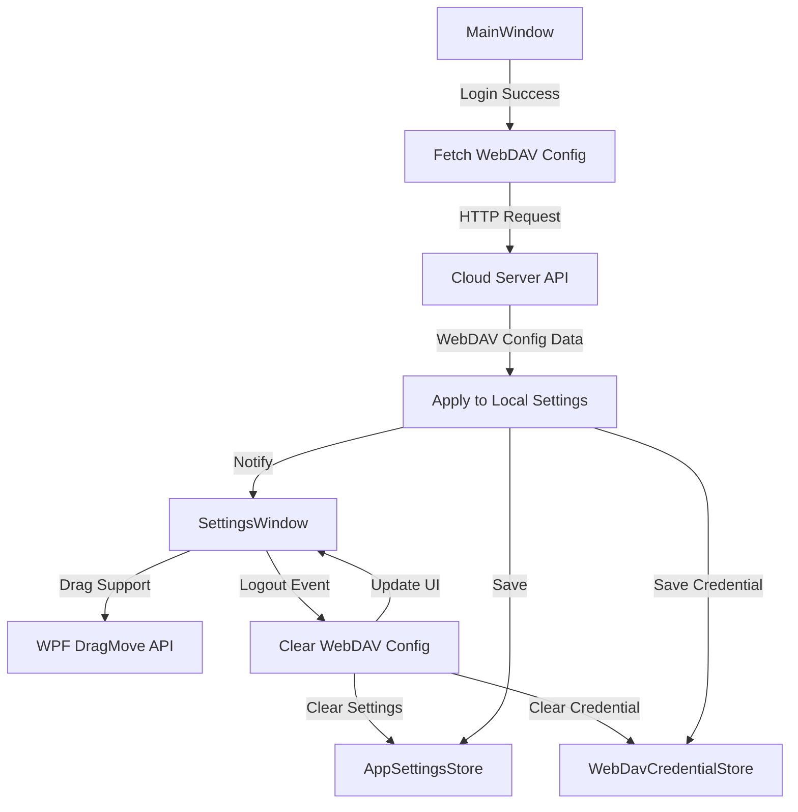

# Design Document: Settings Window Enhancements

## Overview

This design covers three independent enhancements to the Settings Window in the Yanzi (Swallow) application:

1. **Window Drag Support**: Enable users to drag the settings window by clicking on the top area, following the same pattern used in AddJsonExtensionWindow
2. **Clear WebDAV Configuration on Logout**: Automatically clear all WebDAV settings and credentials when the user logs out from their cloud account
3. **Auto-sync WebDAV Configuration on Login**: Automatically fetch and apply WebDAV configuration from the cloud server after successful login

These enhancements improve user experience by providing intuitive window interaction and seamless synchronization of WebDAV settings across devices.

## Architecture

### Component Interaction



### Key Components

- **SettingsWindow.xaml**: XAML markup defining the window structure and top area
- **SettingsWindow.xaml.cs**: Code-behind implementing drag support, logout handling, and UI refresh logic
- **MainWindow.xaml.cs**: Main application window managing cloud sync operations and WebDAV configuration sync
- **AppSettingsStore**: Persistent storage for application settings including WebDAV configuration
- **WebDavCredentialStore**: Secure storage for WebDAV passwords using Windows DPAPI
- **Cloud Sync Client**: HTTP client for communicating with the cloud server API

## Components and Interfaces

### 1. Window Drag Support

#### SettingsWindow.xaml Modifications

**Top Area Identification**: The top area includes the title bar and header section. Based on the existing XAML structure, this is the `Grid` at `Grid.Row="0"` in the content area.

**Event Handler Attachment**: Add `MouseLeftButtonDown` event handler to the top bar Grid element.

```xml
<!-- Top Bar -->
<Grid Grid.Row="0" Margin="15,10,15,10" MouseLeftButtonDown="TitleBar_MouseLeftButtonDown">
    <!-- Existing content -->
</Grid>
```

#### SettingsWindow.xaml.cs Implementation

**Method**: `TitleBar_MouseLeftButtonDown` (already exists but needs to be verified for correct behavior)

**Implementation Pattern** (following AddJsonExtensionWindow):
```csharp
private void TitleBar_MouseLeftButtonDown(object sender, MouseButtonEventArgs e)
{
    if (e.ButtonState != MouseButtonState.Pressed || IsInteractiveSource(e.OriginalSource as DependencyObject))
    {
        return;
    }

    try
    {
        DragMove();
    }
    catch (InvalidOperationException)
    {
        // DragMove can throw if the mouse button is released before WPF starts the drag loop.
    }
}
```

**Helper Method**: `IsInteractiveSource` - Checks if the click originated from an interactive element (button, textbox, checkbox) to prevent drag when interacting with controls.

```csharp
private static bool IsInteractiveSource(DependencyObject? source)
{
    while (source != null)
    {
        if (source is Button or TextBox or CheckBox or ComboBox or Slider)
        {
            return true;
        }
        source = VisualTreeHelper.GetParent(source);
    }
    return false;
}
```

### 2. Clear WebDAV Configuration on Logout

#### SettingsWindow.xaml.cs Modifications

**Method**: `SignOutAsync` - Extend existing method to clear WebDAV configuration

**Implementation**:
```csharp
private async Task SignOutAsync()
{
    _mainWindow.SignOutFromSettings();
    
    // Clear WebDAV configuration
    ClearWebDavConfiguration();
    
    RefreshAccountSummary();
    await Task.CompletedTask;
}

private void ClearWebDavConfiguration()
{
    // Clear UI-bound properties
    EnableWebDavSync = false;
    WebDavServerUrl = string.Empty;
    WebDavRootPath = string.Empty;
    WebDavUsername = string.Empty;
    WebDavPasswordBox.Password = string.Empty;
    
    // Save cleared settings to persistent storage
    _mainWindow.SaveWebDavSettings(false, string.Empty, string.Empty, string.Empty);
    
    // Clear stored credential
    WebDavCredentialStore.Clear();
    
    // Update UI status
    RefreshWebDavSummary();
    SyncStatusText = "已退出登录，WebDAV 配置已清除。";
}
```

**WebDavCredentialStore Extension**: Add `Clear` method to remove stored credentials

```csharp
public static class WebDavCredentialStore
{
    // Existing methods...
    
    public static void Clear()
    {
        var path = GetCredentialFilePath();
        if (File.Exists(path))
        {
            File.Delete(path);
        }
    }
}
```

#### MainWindow.xaml.cs Modifications

**Method**: `SignOutFromSettings` - Verify it triggers the logout flow correctly

The existing implementation should remain unchanged, as the WebDAV clearing logic is handled in SettingsWindow.

### 3. Auto-sync WebDAV Configuration on Login

#### Cloud Server API Endpoint

**Endpoint**: `GET /api/sync/webdav-config`

**Authentication**: Requires valid session token

**Response Format**:
```json
{
  "enabled": true,
  "serverUrl": "https://dav.jianguoyun.com/dav/",
  "rootPath": "/yanzi",
  "username": "user@example.com",
  "password": "encrypted_password_or_null"
}
```

**Error Handling**: If no WebDAV configuration exists on the server, return 404 or empty response.

#### MainWindow.xaml.cs Implementation

**Method**: `PromptLoginFromSettingsAsync` - Extend to fetch WebDAV config after successful login

```csharp
public async Task<bool> PromptLoginFromSettingsAsync()
{
    if (_cloudSyncClient == null)
    {
        return false;
    }

    var ok = await _cloudSyncClient.PromptLoginAsync();
    if (ok)
    {
        // Existing refresh logic...
        await RefreshCloudFromSettingsAsync();
        
        // Fetch and apply WebDAV configuration
        await SyncWebDavConfigFromCloudAsync();
    }
    
    return ok;
}

private async Task SyncWebDavConfigFromCloudAsync()
{
    try
    {
        var config = await _cloudSyncClient.FetchWebDavConfigAsync();
        if (config != null)
        {
            // Apply configuration to local settings
            SaveWebDavSettings(
                config.Enabled,
                config.ServerUrl ?? string.Empty,
                config.RootPath ?? string.Empty,
                config.Username ?? string.Empty
            );
            
            // Save credential if provided
            if (!string.IsNullOrWhiteSpace(config.Password))
            {
                SaveWebDavCredential(config.Username ?? string.Empty, config.Password);
            }
            
            // Notify SettingsWindow to refresh UI if open
            NotifySettingsWindowWebDavConfigChanged();
            
            Debug.WriteLine("WebDAV configuration synced from cloud successfully.");
        }
    }
    catch (Exception ex)
    {
        // Log error but don't block login process
        Debug.WriteLine($"Failed to sync WebDAV config from cloud: {ex.Message}");
    }
}

private void NotifySettingsWindowWebDavConfigChanged()
{
    // If SettingsWindow is open, refresh its WebDAV UI
    var settingsWindow = Application.Current.Windows.OfType<SettingsWindow>().FirstOrDefault();
    settingsWindow?.RefreshWebDavConfigFromExternal();
}
```

#### SettingsWindow.xaml.cs Extension

**Method**: `RefreshWebDavConfigFromExternal` - Public method to refresh WebDAV UI when config changes externally

```csharp
public void RefreshWebDavConfigFromExternal()
{
    _settings = AppSettingsStore.Load();
    EnableWebDavSync = _settings.EnableWebDavSync;
    WebDavServerUrl = string.IsNullOrWhiteSpace(_settings.WebDavServerUrl) 
        ? "https://dav.jianguoyun.com/dav/" 
        : _settings.WebDavServerUrl;
    WebDavRootPath = _settings.WebDavRootPath;
    WebDavUsername = _settings.WebDavUsername;
    
    // Load password from credential store
    var credential = WebDavCredentialStore.Load();
    if (credential != null && !string.IsNullOrWhiteSpace(credential.Password))
    {
        WebDavPasswordBox.Password = credential.Password;
    }
    
    RefreshWebDavSummary();
    SyncStatusText = "WebDAV 配置已从云端同步。";
}
```

#### Cloud Sync Client Extension

**Method**: `FetchWebDavConfigAsync` - New method to fetch WebDAV configuration from cloud

```csharp
public async Task<WebDavConfigDto?> FetchWebDavConfigAsync()
{
    var session = SyncSessionStore.Load();
    if (session == null || session.ExpiresAt <= DateTimeOffset.UtcNow.ToUnixTimeSeconds())
    {
        return null;
    }

    try
    {
        var request = new HttpRequestMessage(HttpMethod.Get, $"{_baseUrl}/api/sync/webdav-config");
        request.Headers.Authorization = new AuthenticationHeaderValue("Bearer", session.Token);
        
        var response = await _httpClient.SendAsync(request);
        
        if (response.StatusCode == HttpStatusCode.NotFound)
        {
            // No WebDAV config on server
            return null;
        }
        
        response.EnsureSuccessStatusCode();
        
        var json = await response.Content.ReadAsStringAsync();
        return JsonSerializer.Deserialize<WebDavConfigDto>(json);
    }
    catch (Exception ex)
    {
        Debug.WriteLine($"Failed to fetch WebDAV config: {ex.Message}");
        return null;
    }
}
```

**DTO Class**:
```csharp
public class WebDavConfigDto
{
    public bool Enabled { get; set; }
    public string? ServerUrl { get; set; }
    public string? RootPath { get; set; }
    public string? Username { get; set; }
    public string? Password { get; set; }
}
```

## Data Models

### Existing Models (No Changes Required)

- **AppSettings**: Contains `EnableWebDavSync`, `WebDavServerUrl`, `WebDavRootPath`, `WebDavUsername`
- **WebDavCredential**: Contains `Username` and `Password` (encrypted via DPAPI)

### New Models

#### WebDavConfigDto

```csharp
public class WebDavConfigDto
{
    [JsonPropertyName("enabled")]
    public bool Enabled { get; set; }
    
    [JsonPropertyName("serverUrl")]
    public string? ServerUrl { get; set; }
    
    [JsonPropertyName("rootPath")]
    public string? RootPath { get; set; }
    
    [JsonPropertyName("username")]
    public string? Username { get; set; }
    
    [JsonPropertyName("password")]
    public string? Password { get; set; }
}
```

## Error Handling

### Window Drag Support

**Error**: `InvalidOperationException` when `DragMove()` is called
- **Cause**: Mouse button released before WPF starts drag loop
- **Handling**: Catch and ignore silently (expected behavior)

### Clear WebDAV Configuration on Logout

**Error**: File deletion failure when clearing credential
- **Cause**: File locked or permission denied
- **Handling**: Log error but continue with logout process

**Error**: Settings save failure
- **Cause**: Disk full or permission denied
- **Handling**: Log error and show user notification

### Auto-sync WebDAV Configuration on Login

**Error**: HTTP request failure (network error, timeout)
- **Cause**: Network connectivity issues or server unavailable
- **Handling**: Log error but don't block login process. User can manually configure WebDAV.

**Error**: 404 Not Found from server
- **Cause**: User has no WebDAV configuration stored on server
- **Handling**: Treat as normal case, don't modify local settings

**Error**: JSON deserialization failure
- **Cause**: Malformed response from server
- **Handling**: Log error and skip WebDAV sync

**Error**: Credential store write failure
- **Cause**: DPAPI encryption failure or disk error
- **Handling**: Log error and notify user that password wasn't saved

## Testing Strategy

### Unit Tests

**Feature 1: Window Drag Support**
- Test that `TitleBar_MouseLeftButtonDown` calls `DragMove()` when clicked on non-interactive area
- Test that `TitleBar_MouseLeftButtonDown` does NOT call `DragMove()` when clicked on button
- Test that `TitleBar_MouseLeftButtonDown` does NOT call `DragMove()` when clicked on textbox
- Test that `IsInteractiveSource` correctly identifies interactive elements

**Feature 2: Clear WebDAV Configuration on Logout**
- Test that `ClearWebDavConfiguration` sets all WebDAV properties to empty/false
- Test that `ClearWebDavConfiguration` calls `SaveWebDavSettings` with cleared values
- Test that `ClearWebDavConfiguration` calls `WebDavCredentialStore.Clear()`
- Test that `ClearWebDavConfiguration` updates UI status text
- Test that `WebDavCredentialStore.Clear()` deletes the credential file

**Feature 3: Auto-sync WebDAV Configuration on Login**
- Test that `SyncWebDavConfigFromCloudAsync` fetches config from server after login
- Test that `SyncWebDavConfigFromCloudAsync` applies fetched config to local settings
- Test that `SyncWebDavConfigFromCloudAsync` saves credential when password is provided
- Test that `SyncWebDavConfigFromCloudAsync` handles 404 response gracefully
- Test that `SyncWebDavConfigFromCloudAsync` handles network errors without blocking login
- Test that `RefreshWebDavConfigFromExternal` updates UI with new config
- Test that `FetchWebDavConfigAsync` includes authentication token in request
- Test that `FetchWebDavConfigAsync` returns null when session is expired

### Integration Tests

**Feature 1: Window Drag Support**
- Manual test: Click and drag on top bar area, verify window moves
- Manual test: Click on search box, verify window does NOT move
- Manual test: Click on navigation buttons, verify window does NOT move

**Feature 2: Clear WebDAV Configuration on Logout**
- Test full logout flow: login → configure WebDAV → logout → verify all WebDAV settings cleared
- Test that credential file is deleted after logout
- Test that SettingsWindow UI reflects cleared state after logout

**Feature 3: Auto-sync WebDAV Configuration on Login**
- Test full login flow: logout → login → verify WebDAV config synced from server
- Test login when server has no WebDAV config → verify local settings unchanged
- Test login when server returns WebDAV config → verify local settings updated
- Test that SettingsWindow UI updates when config is synced during login
- Test that password is correctly stored in credential store after sync

### Manual Testing Checklist

**Window Drag Support**:
- [ ] Open Settings Window
- [ ] Click and drag on title bar area → window moves
- [ ] Click and drag on search box → window does NOT move
- [ ] Click and drag on close button → window does NOT move
- [ ] Click and drag on navigation list → window does NOT move

**Clear WebDAV Configuration on Logout**:
- [ ] Login to cloud account
- [ ] Configure WebDAV settings (enable, set URL, username, password)
- [ ] Click "退出登录" (Sign Out) button
- [ ] Verify all WebDAV fields are cleared
- [ ] Verify WebDAV status shows "未启用个人扩展同步"
- [ ] Verify credential file is deleted from disk

**Auto-sync WebDAV Configuration on Login**:
- [ ] Ensure WebDAV config exists on server (via API or previous sync)
- [ ] Logout from cloud account
- [ ] Clear local WebDAV settings
- [ ] Login to cloud account
- [ ] Verify WebDAV settings are automatically populated
- [ ] Verify WebDAV status shows "已配置: [server URL] [root path]"
- [ ] Verify password is loaded in password box
- [ ] Test with no WebDAV config on server → verify local settings unchanged

## Implementation Notes

### Feature 1: Window Drag Support

- The `TitleBar_MouseLeftButtonDown` method already exists in SettingsWindow.xaml.cs
- Need to verify it's attached to the correct Grid element in XAML
- The `IsInteractiveSource` helper method needs to be added if not present
- Follow the exact pattern from AddJsonExtensionWindow for consistency

### Feature 2: Clear WebDAV Configuration on Logout

- The `SignOutAsync` method already exists and calls `_mainWindow.SignOutFromSettings()`
- Need to add `ClearWebDavConfiguration()` call after sign out
- Need to add `Clear()` method to WebDavCredentialStore class
- Ensure UI refresh happens after clearing to show updated state

### Feature 3: Auto-sync WebDAV Configuration on Login

- Requires backend API endpoint implementation: `GET /api/sync/webdav-config`
- Backend should store WebDAV config per user account
- Password should be encrypted on server side before storage
- Client should handle missing config gracefully (404 response)
- Sync should happen automatically after successful login
- Sync errors should be logged but not block the login process
- If SettingsWindow is open during login, it should refresh automatically

### Security Considerations

- WebDAV passwords are encrypted using Windows DPAPI (machine-specific)
- Passwords synced from cloud should also be encrypted on server side
- Clear all sensitive data on logout to prevent unauthorized access
- Ensure credential file is deleted securely (not just marked for deletion)

### User Experience Considerations

- Window drag should feel natural and responsive
- Dragging should not interfere with clicking buttons or typing in textboxes
- WebDAV config clearing should be immediate and visible to user
- WebDAV config sync should be silent and automatic (no user intervention)
- Error messages should be clear and actionable
- Status text should provide feedback for all operations
