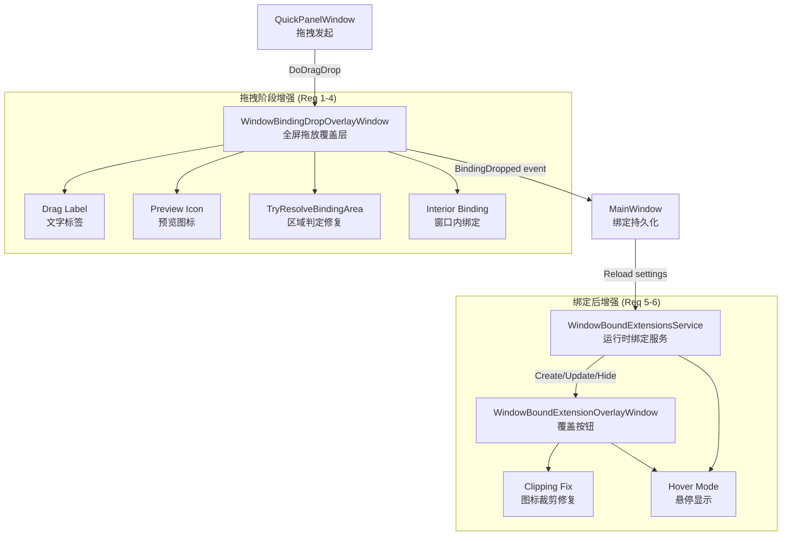

# Design Document: Window Binding Drag Enhancements

## Overview

本设计文档描述窗口绑定拖放体验的六项增强功能的技术实现方案。这些增强覆盖拖拽过程中的视觉反馈（文字标签、预览图标）、绑定区域判定逻辑修复、窗口内部绑定支持、覆盖图标渲染修复、以及悬停显示模式。

所有改动集中在三个核心文件：
- `WindowBindingDropOverlayWindow`（拖放覆盖层 — 拖拽过程中的视觉反馈）
- `WindowBoundExtensionsService`（运行时绑定服务 — 覆盖按钮生命周期管理）
- `WindowBoundExtensionOverlayWindow`（绑定后覆盖按钮 — 图标渲染与交互）

以及数据模型类 `WindowBindingRuleSettings`、`WindowBindingCorners`。

## Architecture



### 设计决策

1. **拖拽标签与预览图标**：在现有 `RootCanvas` 上添加新的 UI 元素，跟随光标位置更新。不引入新窗口，避免多窗口同步问题。

2. **区域判定修复**：重写 `TryResolveBindingArea` 方法，明确区分"边缘优先"和"角落判定"逻辑，使用最近边缘距离作为主要判定依据。

3. **窗口内绑定**：扩展 `WindowBindingCorners` 常量集，新增 `InsideTopLeft`、`InsideTopRight`、`InsideBottomLeft`、`InsideBottomRight` 四个内部位置。`GetBaseLeft`/`GetBaseTop` 根据位置类型切换内/外计算逻辑。

4. **图标裁剪修复**：将 `WindowBoundExtensionOverlayWindow` 窗口尺寸从 34×34 扩大到 50×50（额外 8px 每侧用于阴影），移除 `ClipToBounds="True"`，内部 Border 保持 34×34 居中。

5. **悬停显示模式**：在 `WindowBindingRuleSettings` 中新增 `HoverMode` 属性。`WindowBoundExtensionsService` 在 Tick 中根据光标位置决定是否显示/隐藏覆盖按钮，使用 `DispatcherTimer` 实现延迟隐藏和动画。

## Components and Interfaces

### 1. WindowBindingDropOverlayWindow (修改)

**新增 UI 元素：**
- `DragLabel`：TextBlock，显示扩展名称，跟随光标
- `PreviewIcon`：Border + Image/Path，34×34 半透明预览，显示在目标绑定位置

**修改方法：**
- `Window_DragOver`：增加光标跟随标签更新、预览图标位置计算
- `ShowMarker`：增加预览图标定位逻辑
- `TryResolveBindingArea`：重写判定逻辑，支持内部区域

**新增方法：**
- `UpdateDragLabel(Point cursorPos)`：更新标签位置
- `ShowPreviewIcon(RECT rect, uint dpi, string corner)`：计算并显示预览图标
- `HidePreviewIcon()`：隐藏预览图标
- `ResolveInteriorPosition(POINT point, RECT rect)`：判定窗口内部象限

### 2. WindowBoundExtensionOverlayWindow (修改)

**XAML 变更：**
- Window 尺寸从 34×34 改为 50×50
- 移除内部 Border 的 `ClipToBounds="True"`
- 内部 Border 保持 34×34，通过 Margin="8" 居中
- DropShadowEffect 不再被裁剪

**新增动画：**
- `FadeIn` Storyboard：Opacity 0→1，200ms
- `FadeOut` Storyboard：Opacity 1→0，300ms

### 3. WindowBoundExtensionsService (修改)

**新增方法：**
- `UpdateOverlayVisibilityForHoverMode()`：检测光标是否在检测区域内
- `IsInHoverDetectionZone(WindowBoundExtensionOverlayWindow overlay)`：判定光标是否在覆盖按钮 ±20px 范围内
- `ScheduleHideOverlay(string ruleId)`：500ms 延迟后隐藏
- `CancelScheduledHide(string ruleId)`：取消延迟隐藏

**修改方法：**
- `UpdateOverlayPosition`：支持内部位置计算（InsideTopLeft 等）
- `GetBaseLeft` / `GetBaseTop`：增加内部位置分支
- `Tick`：增加 HoverMode 可见性管理

### 4. WindowBindingCorners (扩展)

```csharp
public static class WindowBindingCorners
{
    // 现有外部位置
    public const string TopLeft = "top_left";
    public const string TopRight = "top_right";
    public const string BottomLeft = "bottom_left";
    public const string BottomRight = "bottom_right";
    
    // 新增内部位置
    public const string InsideTopLeft = "inside_top_left";
    public const string InsideTopRight = "inside_top_right";
    public const string InsideBottomLeft = "inside_bottom_left";
    public const string InsideBottomRight = "inside_bottom_right";
    
    public static bool IsInterior(string corner) => 
        Normalize(corner).StartsWith("inside_");
}
```

### 5. Context Menu Extension

`MainWindow.ShowWindowBindingContextMenu` 新增菜单项：
- "悬停时显示" / "始终显示"（根据当前 HoverMode 状态切换）

## Data Models

### WindowBindingRuleSettings (扩展)

```csharp
public sealed class WindowBindingRuleSettings
{
    // ... 现有属性不变 ...
    
    /// <summary>
    /// Corner 属性现在支持 8 个值：
    /// top_left, top_right, bottom_left, bottom_right (外部)
    /// inside_top_left, inside_top_right, inside_bottom_left, inside_bottom_right (内部)
    /// </summary>
    public string Corner { get; set; } = WindowBindingCorners.TopLeft;
    
    /// <summary>
    /// 悬停显示模式。true 时覆盖按钮默认隐藏，仅在光标接近时显示。
    /// </summary>
    public bool HoverMode { get; set; } = false;
}
```

### TryResolveBindingArea 新逻辑

```csharp
static bool TryResolveBindingArea(POINT point, RECT rect, out string corner)
{
    corner = WindowBindingCorners.TopLeft;
    const int bandPixels = 96;
    
    var width = rect.Right - rect.Left;
    var height = rect.Bottom - rect.Top;
    var isLeftHalf = point.X < rect.Left + width / 2;
    var isTopHalf = point.Y < rect.Top + height / 2;
    
    // 计算到各边缘的距离
    var distToLeft = Math.Abs(point.X - rect.Left);
    var distToRight = Math.Abs(point.X - rect.Right);
    var distToTop = Math.Abs(point.Y - rect.Top);
    var distToBottom = Math.Abs(point.Y - rect.Bottom);
    var minEdgeDist = Math.Min(Math.Min(distToLeft, distToRight), Math.Min(distToTop, distToBottom));
    
    // 判断是否在边缘带内
    var inEdgeBand = minEdgeDist <= bandPixels;
    
    if (!inEdgeBand)
    {
        // 在窗口内部 — 内部绑定
        if (point.X < rect.Left || point.X > rect.Right || 
            point.Y < rect.Top || point.Y > rect.Bottom)
            return false; // 完全在窗口外且不在边缘带
            
        corner = (isTopHalf, isLeftHalf) switch
        {
            (true, true) => WindowBindingCorners.InsideTopLeft,
            (true, false) => WindowBindingCorners.InsideTopRight,
            (false, true) => WindowBindingCorners.InsideBottomLeft,
            (false, false) => WindowBindingCorners.InsideBottomRight,
        };
        return true;
    }
    
    // 在边缘带内 — 外部绑定
    // 确定主要边缘（最近的边）
    var vertical = distToTop <= distToBottom ? "top" : "bottom";
    var horizontal = distToLeft <= distToRight ? "left" : "right";
    
    corner = (vertical, horizontal) switch
    {
        ("top", "right") => WindowBindingCorners.TopRight,
        ("bottom", "left") => WindowBindingCorners.BottomLeft,
        ("bottom", "right") => WindowBindingCorners.BottomRight,
        _ => WindowBindingCorners.TopLeft
    };
    return true;
}
```

### GetBaseLeft / GetBaseTop 内部位置支持

```csharp
static double GetBaseLeft(RECT rect, uint dpi, double widthDip, string corner, double marginDip)
{
    var scale = dpi <= 0 ? 1 : dpi / 96.0;
    var leftDip = rect.Left / scale;
    var rightDip = rect.Right / scale;
    var normalized = WindowBindingCorners.Normalize(corner);
    
    if (WindowBindingCorners.IsInterior(normalized))
    {
        // 内部位置：从窗口内边缘向内偏移
        return normalized switch
        {
            WindowBindingCorners.InsideTopRight or WindowBindingCorners.InsideBottomRight 
                => rightDip - widthDip - marginDip,
            _ => leftDip + marginDip
        };
    }
    
    // 外部位置：原有逻辑
    return normalized switch
    {
        WindowBindingCorners.TopRight or WindowBindingCorners.BottomRight 
            => rightDip + marginDip,
        _ => leftDip - widthDip - marginDip
    };
}
```

### Hover Mode 检测区域

```csharp
bool IsInHoverDetectionZone(WindowBoundExtensionOverlayWindow overlay)
{
    if (!GetCursorPos(out var point)) return false;
    
    var scale = GetDpiScale();
    var x = point.X / scale;
    var y = point.Y / scale;
    const double padding = 20;
    
    return x >= overlay.Left - padding && x <= overlay.Left + overlay.Width + padding &&
           y >= overlay.Top - padding && y <= overlay.Top + overlay.Height + padding;
}
```

## Correctness Properties

*A property is a characteristic or behavior that should hold true across all valid executions of a system — essentially, a formal statement about what the system should do. Properties serve as the bridge between human-readable specifications and machine-verifiable correctness guarantees.*

### Property 1: Text truncation preserves short names and truncates long names

*For any* string of length ≤ 20, the drag label display function should return the string unchanged. *For any* string of length > 20, the function should return a string of exactly 21 characters ending with "…" (the first 20 characters plus ellipsis).

**Validates: Requirements 1.4**

### Property 2: Edge-band binding area resolution correctness

*For any* point within the 96px edge band of a window rect, `TryResolveBindingArea` shall return an external corner where: the vertical component (top/bottom) corresponds to whichever horizontal edge (top or bottom) is nearest to the point, and the horizontal component (left/right) corresponds to whichever vertical edge (left or right) is nearest to the point. When the point is in both a horizontal and vertical edge band simultaneously, the nearest edge takes priority.

**Validates: Requirements 3.1, 3.2, 3.3, 3.4, 3.5**

### Property 3: Interior quadrant resolution correctness

*For any* point that is inside the window rect AND farther than 96px from all edges, `TryResolveBindingArea` shall return an interior corner matching the quadrant: InsideTopLeft if in the top-left quadrant, InsideTopRight if in the top-right quadrant, InsideBottomLeft if in the bottom-left quadrant, InsideBottomRight if in the bottom-right quadrant (quadrants divided by the window center).

**Validates: Requirements 4.2**

### Property 4: Interior overlay position is within window bounds

*For any* valid window rect, DPI value, and interior corner position, the calculated overlay position (from `GetBaseLeft`/`GetBaseTop`) shall place the overlay entirely within the window's DIP-converted bounds (left ≥ window left, right ≤ window right, top ≥ window top, bottom ≤ window bottom).

**Validates: Requirements 4.3**

### Property 5: Preview icon position matches service positioning

*For any* valid window rect, DPI value, corner, and margin setting, the preview icon position calculated in `WindowBindingDropOverlayWindow` shall equal the position calculated by `GetBaseLeft`/`GetBaseTop` in `WindowBoundExtensionsService` for the same inputs.

**Validates: Requirements 2.5**

### Property 6: Hover detection zone boundary correctness

*For any* overlay position (left, top, width, height) and cursor position (x, y), `IsInHoverDetectionZone` shall return true if and only if the cursor is within 20 pixels of the overlay bounds in each direction (x ∈ [left-20, left+width+20] AND y ∈ [top-20, top+height+20]).

**Validates: Requirements 6.4, 6.6**

## Error Handling

| Scenario | Handling |
|----------|----------|
| DPI query returns 0 | Default to 96 DPI (existing behavior preserved) |
| Target window closed during drag | `TryGetCursorTarget` returns false, hide all markers and preview |
| Extension icon source is null | Fall back to glyph/vector icon (existing priority chain) |
| Window rect has zero width/height | Skip binding area resolution, return false |
| HoverMode timer fires after overlay closed | Guard with null/visibility check before animation |
| Interior position calculation yields negative margin | Clamp to window edge (min 0 offset from edge) |
| Settings deserialization with unknown corner value | `Normalize()` falls through to TopLeft default |

## Testing Strategy

### Property-Based Tests (using FsCheck with xUnit)

Property-based testing is appropriate for this feature because the core logic involves pure geometric functions (`TryResolveBindingArea`, `GetBaseLeft`, `GetBaseTop`, `IsInHoverDetectionZone`, text truncation) with large input spaces (arbitrary points, rects, DPI values).

**Library:** FsCheck.Xunit (C#/.NET property-based testing)
**Minimum iterations:** 100 per property

Each property test will be tagged with:
```
// Feature: window-binding-drag-enhancements, Property {N}: {title}
```

**Properties to implement:**
1. Text truncation (Property 1) — generate random strings, verify length-based behavior
2. Edge-band resolution (Property 2) — generate random points in edge bands, verify corner output
3. Interior quadrant resolution (Property 3) — generate random interior points, verify quadrant
4. Interior position bounds (Property 4) — generate rects + interior corners, verify containment
5. Preview position consistency (Property 5) — generate inputs, verify both calculations match
6. Hover zone boundary (Property 6) — generate positions, verify zone membership

### Unit Tests (example-based)

- Verify XAML structure: window size = 50×50, inner Border = 34×34, no ClipToBounds
- Verify DropShadowEffect is not clipped (parent has no ClipToBounds)
- Verify context menu items appear correctly based on HoverMode state
- Verify 500ms delay timer is configured for hover hide
- Verify fade-in/fade-out animation durations (200ms / 300ms)
- Verify `WindowBindingCorners.Normalize` handles all 8 corner values
- Verify `WindowBindingCorners.IsInterior` correctly classifies corners

### Integration Tests

- Drag from QuickPanel → overlay appears → label visible → drop on target → binding created
- Move target window → interior overlay follows
- Enable HoverMode → overlay hides → move cursor near → overlay appears → move away → hides after delay

