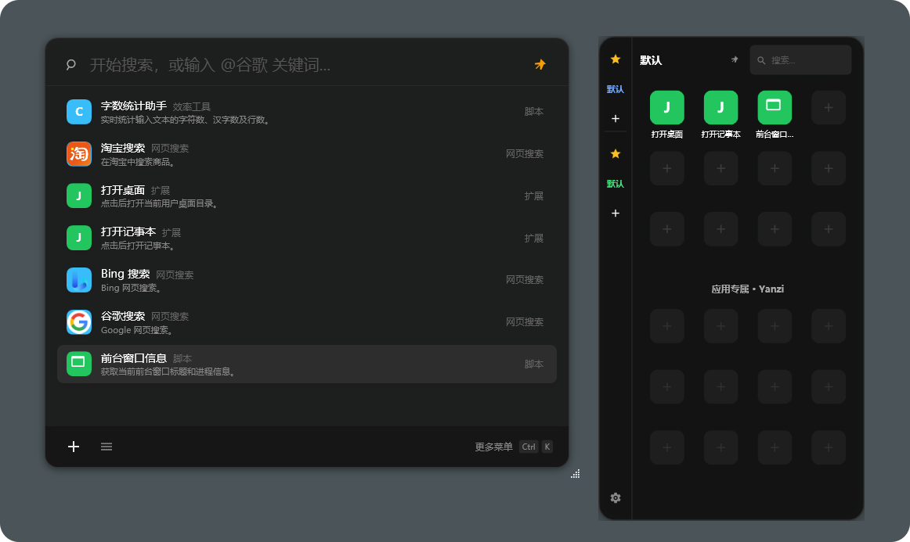
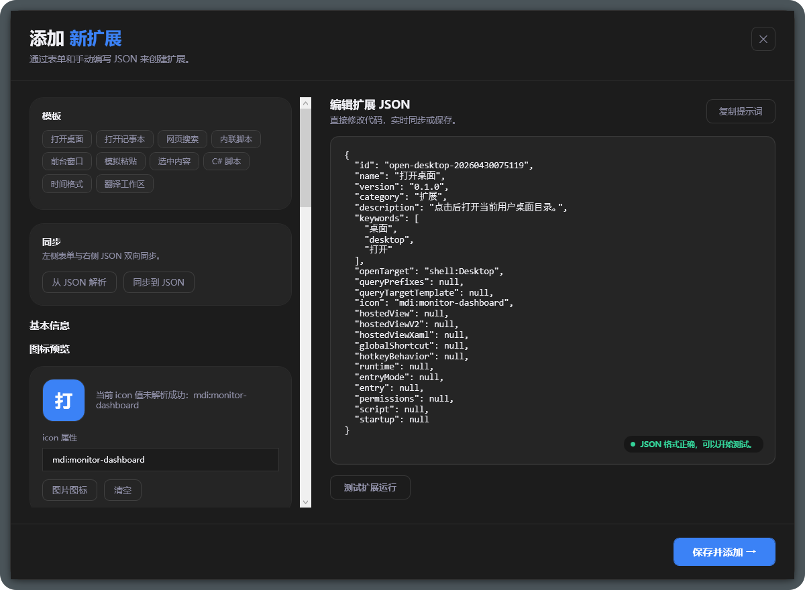
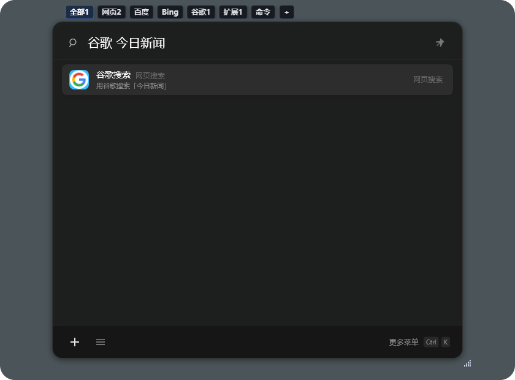
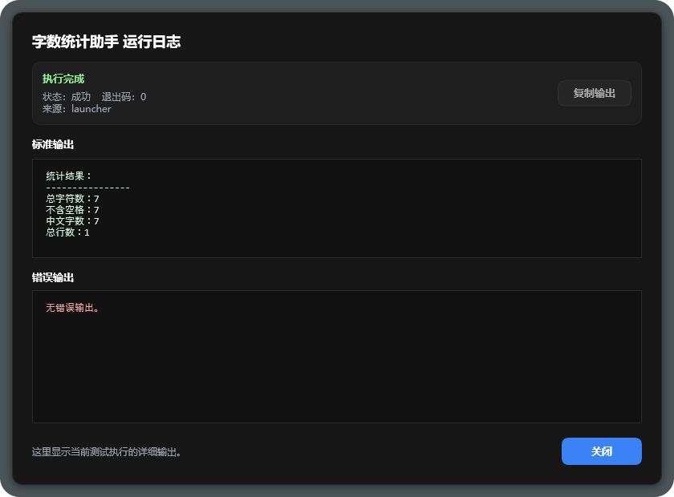

# 燕子 (Yanzi / Swallow)

> 一个以“万物皆扩展”为核心的 Windows 桌面启动器

燕子是一款面向效率用户的 Windows 桌面启动器。它把启动器、鼠标呼出面板、JSON 扩展、脚本运行时和多设备同步放进同一个宿主里，让用户用一套统一的方式组织自己的桌面动作。



当前项目重点已经从“单纯替代 Quicker”转向更清晰的产品路线：

- 主界面负责搜索、执行、扩展管理
- 鼠标面板负责高频收藏动作和快速布局
- 扩展以单文件 JSON 为主，支持 AI 生成、测试、导入
- 脚本和工作区扩展共用同一套宿主能力
- 本地存储、WebDAV / 坚果云同步、账号同步逐步打通

---

## 与 Quicker 相比的优势

| 特性 | 燕子 | Quicker |
|:--|:--|:--|
| 完全开源 | 是 | 否 |
| 无订阅 / 免费使用 | 是 | 付费订阅部分功能 |
| 扩展格式 | 标准 JSON，人类可读 | 私有格式 |
| AI 辅助编写扩展 | 内置提示词工具，一键生成 | 不支持 |
| 云同步方案 | 用户自持 Cloudflare Worker | 官方服务器，无法自控 |
| 本地脚本运行时 | C# / PowerShell，可扩展 | 内置沙盒 |
| 二次开发 | 完整 .NET WPF 源码 | 不可修改 |
| 数据主权 | 全部存储在本地 / 你的云账户 | 存储在第三方服务器 |

---

## 核心功能

- **全局热键呼出** — 默认 `Ctrl+Shift+Space`，在任何界面弹出命令面板
- **命令搜索** — 中文、拼音缩写、英文关键词均可命中
- **参数化命令** — 输入 `谷歌 今天的新闻` 即可执行带参数的搜索模板
- **前缀传参脚本** — 输入 `统计 这段文本` 这类“前缀 + 内容”，可把后半段直接传给脚本扩展
- **脚本扩展** — 内联 C# 动作、PowerShell 脚本或目录脚本入口，支持测试执行与日志查看
- **宿主视图 (Hosted View)** — 扩展可在启动器内开启工作区，支持 `hostedViewXaml` 和 `hostedViewV2`
- **JSON 扩展编辑器** — 内置新增、编辑、测试、纠错提示词复制、剪贴板导入
- **扩展快捷键** — 每个扩展可注册独立全局快捷键，直接触发动作
- **云同步** — 基于 Cloudflare Worker，扩展元数据与包文件跨设备同步
- **扩展市场** — 上传 / 下载其他用户的扩展包
- **快速面板 (Quick Panel)** — 鼠标呼出面板支持收藏分组、复制 / 剪切 / 粘贴扩展布局
- **Agent Skill 导出** — 将启动器内置 Skill 导出到 AI 编码工具（如 Antigravity、Cursor 等）
- **开机自启 / 托盘驻留** — 最小化到系统托盘，随时唤起

## 界面预览

### 1. 主启动器 + 鼠标面板


### 2. JSON 扩展编辑器



### 3. 前缀搜索 / 传参预览



### 4. 脚本执行日志



---

## 用户使用指南

### 1. 下载与安装

从 [Releases](https://github.com/luoluoluo22/yanzi/releases) 页面下载最新版安装包：

- 当前版本：[`YanziSetup-0.1.0.exe`](https://github.com/luoluoluo22/yanzi/releases/download/v0.1.0/YanziSetup-0.1.0.exe)
- Release 页面：<https://github.com/luoluoluo22/yanzi/releases/tag/v0.1.0>

下载后直接运行安装包。安装完成后启动 `Yanzi.exe`，默认使用 `Ctrl+Shift+Space` 呼出启动器。

**系统要求：**
- Windows 10 / 11（64 位）
- 安装包为自包含构建，不需要用户额外安装 .NET 运行时

### 构建输出目录约定

为了避免本地调试、发布和临时验证目录混淆，当前项目只认这两个标准输出目录：

- 调试版：`src\OpenQuickHost\bin\Debug\net9.0-windows\`
- 发布版：`src\OpenQuickHost\bin\Release\net9.0-windows\`

约定说明：

- `src\OpenQuickHost\bin\Debug\net9.0-windows\` 是默认本地运行目录
- `src\OpenQuickHost\bin\Release\net9.0-windows\` 是默认发布构建目录
- 像 `net9.0`、`net9.0-windows-verify` 这类目录，属于历史残留或临时验证目录，不作为正式输出目录使用
- 临时验证输出如果需要保留，统一明确标成 `verify`，验证完成后清理

### 2. 基本操作

| 操作 | 快捷键 / 动作 |
|:--|:--|
| 呼出启动器 | `Ctrl+Shift+Space` |
| 搜索命令 | 直接输入关键字 |
| 切换条目 | `Up / Down` |
| 执行命令 | `Enter` 或双击 |
| 打开动作菜单 | `Ctrl+K` |
| 返回 / 收起 | `Esc` |
| 右键管理 | 右键点击条目 |

### 3. 添加扩展

**方法一：启动器内 `+` 按钮**

1. 呼出启动器，点击底部状态栏右侧 `+`
2. 粘贴扩展 JSON（可让 AI 帮你生成，也支持直接粘贴剪贴板里的 `json` 代码块）
3. 点击保存即可立即使用

**方法二：直接写 JSON 文件**

在应用运行目录的 `Extensions/` 下新建一个子目录，放入 `manifest.json`：

```json
{
  "id": "open-downloads",
  "name": "打开下载目录",
  "version": "0.1.0",
  "category": "目录",
  "description": "打开当前用户的下载目录。",
  "keywords": ["downloads", "下载", "xiazai"],
  "icon": "mdi:folder",
  "openTarget": "C:\\Users\\你的用户名\\Downloads"
}
```

重启启动器或在设置页刷新扩展统计后即可命中。

**方法三：搜索类扩展**

使用 `queryPrefixes` 和 `queryTargetTemplate`。启动器输入 `gg openai`，即可用默认浏览器打开搜索页。

```json
{
  "id": "google-search",
  "name": "谷歌搜索",
  "version": "0.1.0",
  "category": "搜索",
  "description": "用默认浏览器打开 Google 搜索。",
  "keywords": ["google", "谷歌", "gg", "guge"],
  "icon": "mdi:search",
  "queryPrefixes": ["谷歌", "google", "gg", "guge"],
  "queryTargetTemplate": "https://www.google.com/search?q={query}"
}
```

**方法三点五：前缀传参脚本扩展**

如果你希望用户在主界面输入 `前缀 + 内容`，然后把后面的内容直接传给脚本，就要同时提供 `queryPrefixes` 和脚本入口：

```json
{
  "id": "text-length-counter",
  "name": "文本长度统计",
  "version": "0.1.0",
  "category": "脚本",
  "description": "读取主界面输入的后半段文本并返回长度。",
  "keywords": ["文本", "长度", "统计"],
  "queryPrefixes": ["统计", "count"],
  "runtime": "csharp",
  "entryMode": "inline",
  "permissions": ["context.read"],
  "icon": "mdi:counter",
  "script": {
    "source": "using System.Threading.Tasks;\\nusing OpenQuickHost.CSharpRuntime;\\n\\npublic static class YanziAction\\n{\\n    public static Task<string> RunAsync(YanziActionContext context)\\n    {\\n        var input = context.InputText ?? string.Empty;\\n        return Task.FromResult(\\\"原文：\\\" + input + \\\"\\\\n长度：\\\" + input.Length);\\n    }\\n}"
  }
}
```

用户输入 `统计 今天的安排` 后，脚本里收到的 `context.InputText` 就是 `今天的安排`。

**方法四：内联 C# 动作**

快捷面板触发扩展时，燕子会在点击扩展后抓取当前选中的文本或文件路径，并写入 `context.InputText`。

```json
{
  "id": "csharp-selection-summary",
  "name": "选中内容摘要",
  "version": "0.1.0",
  "category": "C#",
  "description": "读取快捷面板传入的选中文本。",
  "keywords": ["csharp", "selection", "选中", "摘要"],
  "icon": "mdi:code",
  "runtime": "csharp",
  "entryMode": "inline",
  "permissions": ["context.read"],
  "script": {
    "source": "using OpenQuickHost.CSharpRuntime;\\n\\npublic static class YanziAction\\n{\\n    public static Task<string> RunAsync(YanziActionContext context)\\n    {\\n        var text = string.IsNullOrWhiteSpace(context.InputText) ? \\\"没有收到选中内容。\\\" : context.InputText.Trim();\\n        return Task.FromResult($\\\"来源: {context.LaunchSource}\\\\n长度: {text.Length}\\\\n\\\\n{text}\\\");\\n    }\\n}"
  }
}
```

**方法五：内联 PowerShell 脚本**

```json
{
  "id": "clipboard-read",
  "name": "读取剪贴板",
  "version": "0.1.0",
  "category": "脚本",
  "description": "读取当前剪贴板文本。",
  "keywords": ["clipboard", "剪贴板"],
  "icon": "mdi:clipboard",
  "runtime": "powershell",
  "entryMode": "inline",
  "permissions": ["clipboard.read"],
  "script": {
    "source": "param([string]$InputText = \\\"\\\", [string]$ContextPath = \\\"\\\")\\n[Console]::OutputEncoding = [System.Text.Encoding]::UTF8\\n$text = Get-Clipboard -Raw\\nif ([string]::IsNullOrWhiteSpace($text)) { Write-Output \\\"当前剪贴板为空。\\\" } else { Write-Output $text.Trim() }"
  }
}
```

**方法六：宿主界面扩展**

适合翻译、文本处理、查询等需要输入区和结果区的工具。`actionType = "script"` 时，按钮会执行当前扩展的 C# 或 PowerShell 入口，并把结果显示在右侧。

```json
{
  "id": "text-workbench",
  "name": "文本处理台",
  "version": "0.1.0",
  "category": "工具",
  "description": "在宿主窗口中输入文本并执行 C# 动作。",
  "keywords": ["text", "文本", "workbench"],
  "icon": "mdi:terminal",
  "runtime": "csharp",
  "entryMode": "inline",
  "hostedView": {
    "type": "split-workbench",
    "title": "文本处理台",
    "description": "左侧输入文本，右侧显示执行结果。",
    "inputLabel": "输入",
    "inputPlaceholder": "输入要处理的文本...",
    "outputLabel": "结果",
    "actionButtonText": "执行",
    "actionType": "script",
    "emptyState": "结果会显示在这里。"
  },
  "script": {
    "source": "using OpenQuickHost.CSharpRuntime;\\n\\npublic static class YanziAction\\n{\\n    public static Task<string> RunAsync(YanziActionContext context)\\n    {\\n        return Task.FromResult(context.InputText.ToUpperInvariant());\\n    }\\n}"
  }
}
```

更多示例见 [扩展编写指南](docs/extension-authoring-guide.md)。

### 4. 云同步

当前客户端支持两类同步：

- Cloudflare 账号同步：用于账号、分享扩展、坚果云配置等账户级信息。
- 坚果云 / WebDAV 个人扩展同步：用于低频同步个人扩展包，适合多设备恢复和备份。

推荐流程：

1. 在设置窗口登录燕子云账号。
2. 在“同步”设置里配置坚果云 / WebDAV。
3. 点击“立即同步”完成首轮上传或拉取。
4. 后续新建、修改、删除扩展后，客户端会按低频策略进行后台同步。

---

## 开发者部署指南

### 本地构建与运行

**前置依赖：**
- [.NET 9 SDK](https://dotnet.microsoft.com/download)
- Windows 系统（WPF 依赖 Windows）

```powershell
# 克隆仓库
git clone https://github.com/luoluoluo22/yanzi.git
cd yanzi

# 编译
dotnet build

# 运行（Debug）
.\src\OpenQuickHost\bin\Debug\net9.0-windows\Yanzi.exe
```

### 发布单文件可执行程序

```powershell
dotnet publish .\src\OpenQuickHost\OpenQuickHost.csproj -c Release -r win-x64 --self-contained true -p:PublishSingleFile=true -o .\publish
```

输出文件在 `./publish/Yanzi.exe`，可直接分发给用户，无需安装 .NET 运行时。

也可以使用仓库脚本生成发布产物：

```powershell
.\scripts\publish-installer.ps1 -Version 0.1.0
```

脚本会先生成自包含单文件：`.artifacts\publish\win-x64\Yanzi.exe`。
如果本机安装了 Inno Setup 6，还会继续生成一键安装包：`.artifacts\installer\YanziSetup-0.1.0.exe`。

### 配置云同步后端（Cloudflare Worker）

云同步基于 Cloudflare Worker + KV 存储，**你需要部署自己的 Worker 实例**。

```powershell
# 进入 Worker 目录
cd cloudflare

# 安装依赖
npm install

# 部署到你的 Cloudflare 账户
npx wrangler deploy
```

部署完成后，将 Worker 的 URL 填入项目根目录的 `syncsettings.json`：

```json
{
  "baseUrl": "https://your-worker.your-account.workers.dev"
}
```

参考示例文件：`syncsettings.example.json`。

### 网站部署（Cloudflare Pages）

官网静态站位于 `website/` 目录：

```powershell
# 部署到 Cloudflare Pages
npx wrangler pages deploy ./website --project-name openquickhost-site --branch main
```

### 目录说明

```text
OpenQuickHost/
├── OpenQuickHost.sln          根目录解决方案
├── src/
│   └── OpenQuickHost/         WPF 桌面应用源码
│       ├── MainWindow.xaml / .cs
│       ├── SettingsWindow.xaml / .cs
│       ├── QuickPanelWindow.xaml / .cs
│       ├── AddJsonExtensionWindow.*
│       ├── ScriptExtensionRunner.cs
│       ├── LocalAgentApiServer.cs
│       └── Sync/
├── cloudflare/                Cloudflare Worker 后端源码
├── website/                   官网静态站源码
├── docs/                      产品说明与扩展规范文档
├── installer/                 Inno Setup 一键安装包脚本
├── scripts/                   发布与验证脚本
├── skills/                    内置 Agent Skill 包
└── syncsettings.example.json  云同步配置示例
```

---

## 扩展规范文档

| 文档 | 说明 |
|:--|:--|
| [产品说明](docs/product-overview.md) | 设计原则与产品定位 |
| [扩展编写指南](docs/extension-authoring-guide.md) | 面向用户和 AI 的扩展写作示例 |
| [扩展规范](docs/extension-spec.md) | manifest.json 完整字段说明 |
| [Agent Skill 规范](docs/agent-skill-spec.md) | 为 AI 工具导出 Skill 的格式规范 |
| [使用说明](docs/getting-started.md) | 快速上手指南 |

---

## 开源协议

本项目以 MIT 协议开源，欢迎 Fork、提 PR 或基于此构建你自己的启动器工具。
