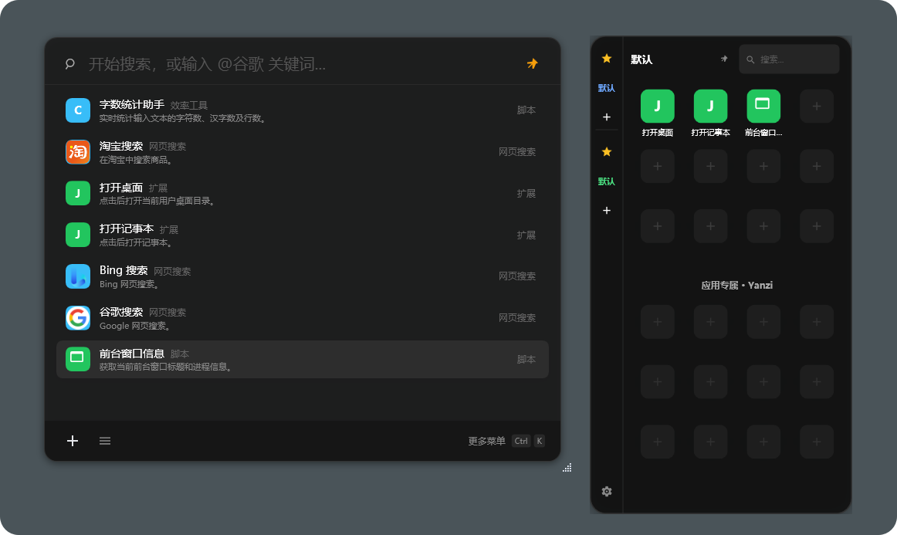
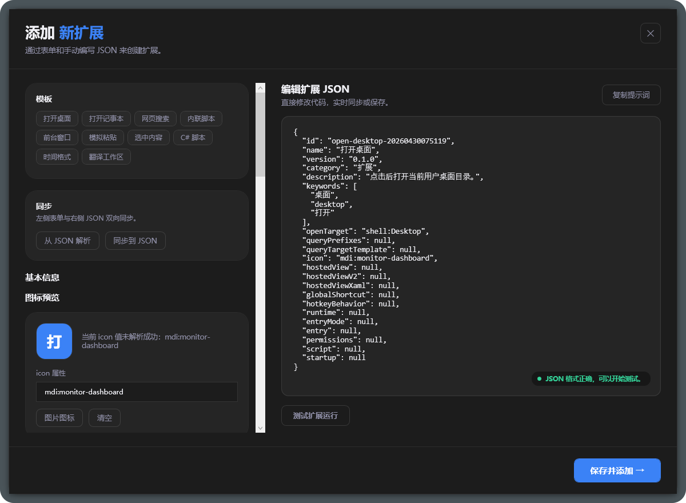
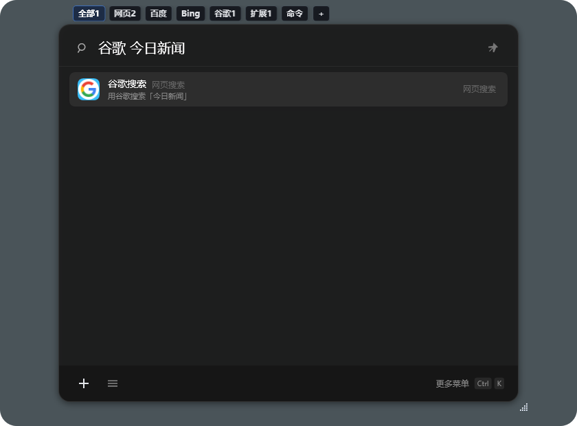
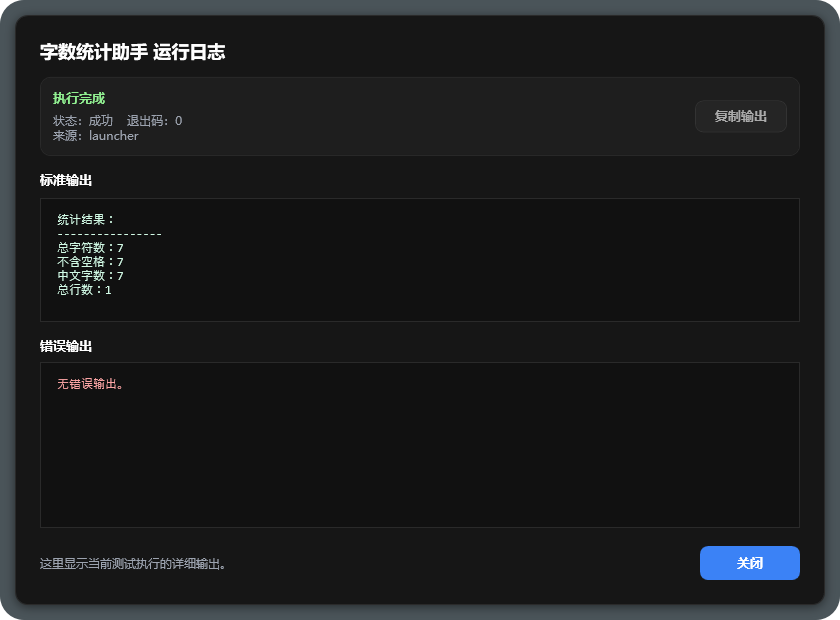

# 燕子启动器 (Yanzi)

> [!NOTE]
> **关于燕子开源里程碑与后续赞助者维护计划的说明**
> - **开源承诺**：燕子启动器 0.3.x 之前的所有核心代码永久开源保留。本地快捷启动、鼠标面板、本地搜索等基础功能**永久免费**，绝不设卡。
> - **维护与增值支持**：为了覆盖长期云同步服务器开销、移动端中继及新系统持续适配精力，燕子后续版本转入“基础功能免费 + 赞助者维护计划”模式持续独立维护。
> - **更新分发保障**：安装包继续在此公开仓库的 Releases 中公开发布与分发，旧版本无缝平稳使用。
>
> 🌐 **官方网站/在线文档**：[https://yanzi.luoluoluo.cc.cd/](https://yanzi.luoluoluo.cc.cd/)

平时要找文件、开软件、切工具，来回点半天很烦。

燕子把常用东西放进轮盘菜单和鼠标面板里，**长按右键就能直接用**；需要新工具时，还能让 AI 帮你**一句话做出来**。所有数据都存本地，不用担心隐私泄露。



**一句话说清楚燕子能干嘛：**

- 长按右键弹出轮盘菜单，常用操作直接点一下就能做
- 鼠标面板像“秒板”一样，把最常用的东西放到手边
- 让 AI 帮你一句话生成工具，不懂编程也能自己做
- 所有数据存你自己电脑，不怕隐私泄露
- 免费开源，放心长期用

---

## 和 Quicker 比，燕子好在哪里？

| 我关心的问题 | 燕子怎么说 | 我得到的好处 |
| :-- | :-- | :-- |
| 操作会不会很麻烦？ | 长按右键弹轮盘，常用功能一划就到 | 少点很多次鼠标 |
| 能不能自己做工具？ | 可以，AI 一句话就能帮你生成 | 小白也能定制工具 |
| 数据会不会上传？ | 不会，默认存本地 | 用着更放心 |
| 要不要花钱？ | 完全免费 | 不用担心订阅和涨价 |
| 能长期用吗？ | 开源公开 | 不怕突然停服


---

## 主要功能

- **轮盘菜单** — 长按右键就弹出，把最常用的操作放到鼠标边上
- **鼠标面板** — 像“秒板”一样，把常用软件、文件、网站放在手边
- **AI 生成工具** — 告诉 AI 你想要什么，燕子帮你变成能用的工具
- **快速搜索** — 输入几个字就能找到软件、文件和网页
- **自动化脚本** — 批量重命名、自动整理文件、定时操作，一键搞定
- **数据本地保存** — 配置存在你自己电脑里，更安心
- **扩展市场** — 下载别人分享的现成工具，也可以分享自己的工具
- **后台驻留** — 最小化到系统托盘，随时呼出，不占地方


## 界面预览

### 1. 主启动器 + 鼠标面板


### 2. JSON 扩展编辑器



### 3. 前缀搜索 / 传参预览



### 4. 脚本执行日志



---

## 用户使用指南

### 1. 下载与安装

从蓝奏云下载最新版安装包：

- 下载地址：<https://wwbnh.lanzout.com/b0pnkaj6j>
- 提取密码：`62yn`

下载后直接运行安装包。安装完成后启动 `Yanzi.exe`，默认使用 `Alt+Space` 呼出启动器。

**系统要求：**
- Windows 10 / 11（64 位）
- 安装包为自包含构建，不需要用户额外安装 .NET 运行时

### 构建输出目录约定

为了避免本地调试、发布和临时验证目录混淆，当前项目只认这两个标准输出目录：

- 调试版：`src\OpenQuickHost\bin\Debug\net9.0-windows\`
- 发布版：`src\OpenQuickHost\bin\Release\net9.0-windows\`

约定说明：

- `src\OpenQuickHost\bin\Debug\net9.0-windows\` 是默认本地运行目录
- `src\OpenQuickHost\bin\Release\net9.0-windows\` 是默认发布构建目录
- 像 `net9.0`、`net9.0-windows-verify` 这类目录，属于历史残留或临时验证目录，不作为正式输出目录使用
- 临时验证输出如果需要保留，统一明确标成 `verify`，验证完成后清理

### 2. 基本操作

| 操作         | 快捷键 / 动作  |
| :----------- | :------------- |
| 呼出启动器   | `Alt+Space`    |
| 搜索命令     | 直接输入关键字 |
| 切换条目     | `Up / Down`    |
| 执行命令     | `Enter` 或双击 |
| 打开动作菜单 | `Ctrl+K`       |
| 返回 / 收起  | `Esc`          |
| 右键管理     | 右键点击条目   |

### 3. 添加扩展

**方法一：启动器内 `+` 按钮**

1. 呼出启动器，点击底部状态栏右侧 `+`
2. 粘贴扩展 JSON（可让 AI 帮你生成，也支持直接粘贴剪贴板里的 `json` 代码块）
3. 点击保存即可立即使用

**方法二：直接写 JSON 文件**

在应用运行目录的 `Extensions/` 下新建一个子目录，放入 `manifest.json`：

```json
{
  "id": "open-downloads",
  "name": "打开下载目录",
  "version": "0.1.0",
  "category": "目录",
  "description": "打开当前用户的下载目录。",
  "keywords": ["downloads", "下载", "xiazai"],
  "icon": "mdi:folder",
  "openTarget": "C:\\Users\\你的用户名\\Downloads"
}
```

重启启动器或在设置页刷新扩展统计后即可命中。

**方法三：搜索类扩展**

使用 `queryPrefixes` 和 `queryTargetTemplate`。启动器输入 `gg openai`，即可用默认浏览器打开搜索页。

```json
{
  "id": "google-search",
  "name": "谷歌搜索",
  "version": "0.1.0",
  "category": "搜索",
  "description": "用默认浏览器打开 Google 搜索。",
  "keywords": ["google", "谷歌", "gg", "guge"],
  "icon": "mdi:search",
  "queryPrefixes": ["谷歌", "google", "gg", "guge"],
  "queryTargetTemplate": "https://www.google.com/search?q={query}"
}
```

**方法三点五：前缀传参脚本扩展**

如果你希望用户在主界面输入 `前缀 + 内容`，然后把后面的内容直接传给脚本，就要同时提供 `queryPrefixes` 和脚本入口：

```json
{
  "id": "text-length-counter",
  "name": "文本长度统计",
  "version": "0.1.0",
  "category": "脚本",
  "description": "读取主界面输入的后半段文本并返回长度。",
  "keywords": ["文本", "长度", "统计"],
  "queryPrefixes": ["统计", "count"],
  "runtime": "csharp",
  "entryMode": "inline",
  "permissions": [],
  "icon": "mdi:counter",
  "script": {
    "source": "using System.Threading.Tasks;\\npublic static class YanziAction\\n{\\n    public static Task<string> RunAsync(YanziActionContext context)\\n    {\\n        var input = context.InputText ?? string.Empty;\\n        return Task.FromResult(\\\"原文：\\\" + input + \\\"\\\\n长度：\\\" + input.Length);\\n    }\\n}"
  }
}
```

用户输入 `统计 今天的安排` 后，脚本里收到的 `context.InputText` 就是 `今天的安排`。

**方法四：内联 C# 动作**

快捷面板触发扩展时，燕子会在点击扩展后抓取当前选中的文本或文件路径，并写入 `context.InputText`。

```json
{
  "id": "csharp-selection-summary",
  "name": "选中内容摘要",
  "version": "0.1.0",
  "category": "C#",
  "description": "读取快捷面板传入的选中文本。",
  "keywords": ["csharp", "selection", "选中", "摘要"],
  "icon": "mdi:code",
  "runtime": "csharp",
  "entryMode": "inline",
  "permissions": ["context.read"],
  "script": {
    "source": "public static class YanziAction\\n{\\n    public static Task<string> RunAsync(YanziActionContext context)\\n    {\\n        var text = string.IsNullOrWhiteSpace(context.InputText) ? \\\"没有收到选中内容。\\\" : context.InputText.Trim();\\n        return Task.FromResult($\\\"来源: {context.LaunchSource}\\\\n长度: {text.Length}\\\\n\\\\n{text}\\\");\\n    }\\n}"
  }
}
```

**方法五：内联 PowerShell 脚本**

```json
{
  "id": "clipboard-read",
  "name": "读取剪贴板",
  "version": "0.1.0",
  "category": "脚本",
  "description": "读取当前剪贴板文本。",
  "keywords": ["clipboard", "剪贴板"],
  "icon": "mdi:clipboard",
  "runtime": "powershell",
  "entryMode": "inline",
  "permissions": ["clipboard.read"],
  "script": {
    "source": "param([string]$InputText = \\\"\\\", [string]$ContextPath = \\\"\\\")\\n[Console]::OutputEncoding = [System.Text.Encoding]::UTF8\\n$text = Get-Clipboard -Raw\\nif ([string]::IsNullOrWhiteSpace($text)) { Write-Output \\\"当前剪贴板为空。\\\" } else { Write-Output $text.Trim() }"
  }
}
```

**方法六：宿主界面扩展**

适合翻译、文本处理、查询等需要输入区和结果区的工具。`actionType = "script"` 时，按钮会执行当前扩展的 C# 或 PowerShell 入口，并把结果显示在右侧。

```json
{
  "id": "text-workbench",
  "name": "文本处理台",
  "version": "0.1.0",
  "category": "工具",
  "description": "在宿主窗口中输入文本并执行 C# 动作。",
  "keywords": ["text", "文本", "workbench"],
  "icon": "mdi:terminal",
  "runtime": "csharp",
  "entryMode": "inline",
  "hostedView": {
    "type": "split-workbench",
    "title": "文本处理台",
    "description": "左侧输入文本，右侧显示执行结果。",
    "inputLabel": "输入",
    "inputPlaceholder": "输入要处理的文本...",
    "outputLabel": "结果",
    "actionButtonText": "执行",
    "actionType": "script",
    "emptyState": "结果会显示在这里。"
  },
  "script": {
    "source": "public static class YanziAction\\n{\\n    public static Task<string> RunAsync(YanziActionContext context)\\n    {\\n        return Task.FromResult(context.InputText.ToUpperInvariant());\\n    }\\n}"
  }
}
```

更多示例见 [扩展编写指南](docs/extension-authoring-guide.md)。

### 4. 云同步

当前客户端支持两类同步：

- Cloudflare 账号同步：用于账号、分享扩展、账号级设置和个人同步配置。
- 个人同步仓库：支持 WebDAV、GitHub、Gitee、GitLab、Gitea 和 S3 兼容存储，用于同步个人扩展包、扩展数据、配置备份和燕幕状态。

登录账号时，账号私有库是扩展包权威，个人同步仓库中的扩展包只做上传备份；未登录时个人仓库保持双向扩展包同步。扩展私有数据按 key 保存 revision、不可变历史、pending 和冲突副本，设置页可以看清来源并逐项选择本地或远端版本。

推荐流程：

1. 在设置窗口登录燕子云账号。
2. 在“同步”设置里选择并配置个人同步后端。
3. 点击“立即同步”完成首轮上传或拉取。
4. 后续新建、修改、删除扩展后，客户端会按低频策略进行后台同步。

---

## 开发者部署指南

### 本地构建与运行

**前置依赖：**
- [.NET 9 SDK](https://dotnet.microsoft.com/download)
- Windows 系统（WPF 依赖 Windows）

```powershell
# 克隆仓库
git clone https://github.com/luoluoluo22/yanzi.git
cd yanzi

# 编译
dotnet build

# 运行（Debug）
.\src\OpenQuickHost\bin\Debug\net9.0-windows\Yanzi.exe
```

### 发布单文件可执行程序

```powershell
dotnet publish .\src\OpenQuickHost\OpenQuickHost.csproj -c Release -r win-x64 --self-contained true -p:PublishSingleFile=true -o .\publish
```

输出文件在 `./publish/Yanzi.exe`，可直接分发给用户，无需安装 .NET 运行时。

也可以使用仓库脚本生成发布产物：

```powershell
.\scripts\publish-installer.ps1 -Version 0.1.0
```

脚本会先生成自包含单文件：`.artifacts\publish\win-x64\Yanzi.exe`。
如果本机安装了 Inno Setup 6，还会继续生成一键安装包：`.artifacts\installer\YanziSetup-0.1.0.exe`。

### 配置云同步后端（Cloudflare Worker）

账号云同步基于 Cloudflare Worker + D1 + R2，**自建后端时需要在自己的 Cloudflare 账户中创建并绑定 D1 数据库和 R2 存储桶**。

```powershell
# 进入 Worker 目录
cd cloudflare

# 安装依赖
npm install

# 首次部署和升级时先应用 D1 迁移（包括对象 revision 与不可变历史）
npx wrangler d1 migrations apply openquickhost-sync-db --remote --config wrangler.toml

# 部署到你的 Cloudflare 账户
npx wrangler deploy
```

升级期间先不要设置 `SYNC_OBJECTS_AUTHORITATIVE`，新客户端会安全双写对象协议和旧快照。完成真实账号多设备验证后，再将它设为 `true` 切换为对象权威模式。设置页可以直接查看每个对象的 revision、来源设备、冲突和历史恢复记录。

部署完成后，将 Worker 的 URL 填入项目根目录的 `syncsettings.json`：

```json
{
  "baseUrl": "https://your-worker.your-account.workers.dev"
}
```

参考示例文件：`syncsettings.example.json`。

### 网站部署（Cloudflare Pages）

官网静态站位于 `website/` 目录：

```powershell
# 部署到 Cloudflare Pages
npx wrangler pages deploy ./website --project-name openquickhost-site --branch main
```

### 目录说明

```text
OpenQuickHost/
├── OpenQuickHost.sln          根目录解决方案
├── src/
│   └── OpenQuickHost/         WPF 桌面应用源码
│       ├── MainWindow.xaml / .cs
│       ├── SettingsWindow.xaml / .cs
│       ├── QuickPanelWindow.xaml / .cs
│       ├── AddJsonExtensionWindow.*
│       ├── ScriptExtensionRunner.cs
│       ├── LocalAgentApiServer.cs
│       └── Sync/
├── cloudflare/                Cloudflare Worker 后端源码
├── website/                   官网静态站源码
├── docs/                      产品说明与扩展规范文档
├── installer/                 Inno Setup 一键安装包脚本
├── scripts/                   发布与验证脚本
├── skills/                    内置 Agent Skill 包
└── syncsettings.example.json  云同步配置示例
```

---

## 扩展规范文档

| 文档                                              | 说明                            |
| :------------------------------------------------ | :------------------------------ |
| [产品说明](docs/product-overview.md)              | 设计原则与产品定位              |
| [扩展编写指南](docs/extension-authoring-guide.md) | 面向用户和 AI 的扩展写作示例    |
| [扩展规范](docs/extension-spec.md)                | manifest.json 完整字段说明      |
| [Agent Skill 规范](docs/agent-skill-spec.md)      | 为 AI 工具导出 Skill 的格式规范 |
| [使用说明](docs/getting-started.md)               | 快速上手指南                    |

---

## 更新日志

### 2026-05-15

- 优化燕幕默认组件样式，移除天气模块和残留说明文案，恢复便签组件并统一新增组件 HTML/AI 提示词风格。
- 修复燕幕多屏定位漂移、同步按钮触发后退出、便签同步延迟和本地缓存读取等问题。
- 扩展燕环触发配置，支持 Win、CapsLock、自定义快捷键和鼠标触发统一分配。
- 为燕环、燕幕、燕选增加进程黑白名单管理，并支持通过定位窗口自动添加目标进程。
- 新增鼠标触发录制窗口，可将识别到的鼠标动作分配给面板、燕环或燕幕。
- 调整燕选黑名单作用范围，避免影响燕环、鼠标面板等其他输入逻辑。
- 新增输入状态窗口和托盘修复入口，便于查看和重置键盘、鼠标状态。

---

## 开源协议与版权声明

本项目以 **[GNU General Public License v3.0 (GPLv3)](LICENSE)** 协议开源，供个人、技术交流与非营利性质自由学习使用。

> [!CAUTION]
> **商业保护与防倒卖声明**：
> 1. 本项目严禁任何未经原始版权所有者书面授权将源代码或编译二进制包用于商业打包销售、转售、电商倒卖或闭源变相收费分发。
> 2. 如需在商业产品中集成或获得闭源商业授权，请联系作者获取正式授权许可。
