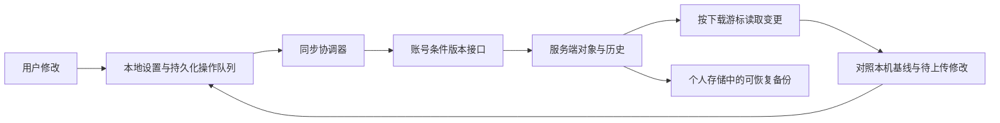

# 同步架构完整评估与本轮改进

评估日期：2026-09-22。依据当前仓库代码、用户截图、本地 .NET 验证、Worker 本地协议验证。不是生产环境的多设备可靠性认证。

## 总体判断

现有“账号对象同步 + 个人存储备份 + 本地离线状态”方向合理，具备对象版本、条件写入、历史记录、删除标记和密钥隔离等基础。不建议整体推倒，也不建议把所有内容改成最后写入者覆盖。

但此前存在会漏拉修改、丢失冲突副本、误认本机修改和改变数据权威的实际问题。本轮已修复其中可在当前协议下安全落地的部分。仍不能称为所有客户端、所有存储平台都具备强一致同步：网页/手机旧接口、个人仓库并发控制、跨对象提交、完整持久化操作队列尚需分阶段完成。

## 数据应由谁负责

| 数据 | 当前路径与合理职责 | 约束 |
| --- | --- | --- |
| 通用设置、快捷面板、燕环 | 账号对象接口为主要来源，个人仓库保留备份 | 只按版本判断先后，不按电脑时间强行覆盖 |
| 燕幕布局与组件内容 | 桌面已拆成布局、索引和逐 key 对象 | 网页、手机必须逐步接入同一对象协议 |
| 小程序安装包 | 登录状态下账号私有库负责，个人仓库保留备份 | 包归档仍需条件版本与可恢复历史 |
| 小程序私有数据 | 个人存储中的逐 key 对象、历史文件和 head | 只有不可变历史还不等于并发安全 |
| API Key、仓库 Token/密码 | 本机凭据存储，云端只保存必要元数据 | 当前验证覆盖了密钥不进入设置载荷 |
| 窗口尺寸、可执行文件路径、设备状态 | 本机 | 不能把设备路径当成可跨设备配置 |
| 待上传修改、冲突副本、下载进度 | 按账号保存的本地同步记录 | 断网、重启、切换账号不应丢失 |

设置覆盖检查现已包含 87 个 AppSettings 属性。这表示每项都有明确归属，不表示 87 项全部上传。本轮为之前缺少归属的网格尺寸、进程路径、设备输入策略、引导状态和本地成就等补充了当前策略；账号级成就合并尚未实现。

## 已落实的修复

| 问题 | 实际风险 | 本轮处理 |
| --- | --- | --- |
| 单个对象上传成功后推进全局下载游标 | 跳过其他设备同时提交的对象 | 上传确认不再推进下载进度；只按真正收到的对象推进 |
| Worker 查询对象后才读取最新水位 | 查询结束后的修改可能被误记为已下载 | 先取得水位，查询限定在该水位内；增加并发插入回归测试 |
| 老客户端已保存错误游标 | 升级后继续漏拉 | 新逻辑首次执行重新读取对象；保留待上传与冲突记录 |
| 快捷面板和燕幕各用一把锁，却保存同一状态 | 两条链互相覆盖缓存、队列、冲突 | 账号对象的完整读改写流程使用同一异步锁，拉取也受保护 |
| 当前界面已采用云端内容，但后台又更新冲突的本机副本 | 原本保留的本机修改被冲掉 | 普通同步跳过未解决冲突，不用当前界面替换保留副本 |
| 上传预检查读取云端后，缓存被误用作本机基线 | 后续把未应用的云端变化当成本机编辑反推 | 单独保存 LocalBaselines；真正应用或确认相同内容后才推进本机基线 |
| 下载前未识别离线修改，或等待网络时用户继续修改 | 云端结果覆盖刚保存的本机内容 | 拉取前后对照原始本机基线收集待上传项；手动下载检测期间的本机变化 |
| 保存的 expectedRevision=0 被加载逻辑改成最新远端版本 | 原应冲突的创建操作变成允许覆盖 | 只为没有操作记录的旧格式队列补基线，现有操作的 0 保持不变 |
| 能力查询失败时退回无条件旧快照写入 | 断网/服务错误改变同步安全级别 | 失败就延后，不把错误当成允许降级；旧协议仅在服务端明确支持时使用 |
| 迁移回填覆盖已有对象 | 旧整包覆盖新对象 | 回填只创建缺失对象，不更新已有对象 |
| 登录令牌过期导致个人仓库切为双向同步 | 过期备份重新成为设置来源 | 会话身份或保存的登录凭据仍存在时，维持账号主同步、仓库备份职责 |
| 所有账号共用一个本地状态文件 | 切换账号后覆盖上一账号离线记录 | 按账号哈希分别保存；兼容读取旧状态，不删除旧文件 |
| 状态文件损坏被当成全新状态 | 丢失队列和冲突后继续写入 | 原子替换并保留上一份记录；损坏时尝试恢复，无法恢复则阻止写入；保留损坏原件 |
| 备份目录损坏后重建空目录 | 原有历史消失或错误清理 | 严格校验结构、路径、哈希、重复 ID；损坏时停止更新目录 |
| 同设备同时间戳生成重复恢复点 | 历史备份被覆盖 | 恢复点增加随机唯一标识，文件路径由该标识派生 |

此前一轮已处理的语义比较、相同内容消除冲突、冲突版本信息刷新、中文界面用语，本轮继续保留。

## 上传、下载箭头

“立即同步”左侧增加 ↑、↓，有悬停说明和可访问名称。三个按钮共享忙碌状态，避免重复点击同时发起多次手动操作。

- ↑ 上传账号设置：上传本机修改，包含快捷面板、燕环和燕幕对象。会读取云端版本用于条件检查，但不把云端设置应用到本机。真正冲突保留两份，不强行任选一份。
- ↓ 下载账号设置：读取并应用云端设置，保留待上传的本机修改。首次在已有内容的设备下载时，对能识别的不同内容保留本机副本。不顺带触发个人仓库上传。
- 立即同步：先尝试上传账号设置，再进入原有完整刷新流程。原有小程序和个人仓库的后台工作仍独立完成，并非一个跨系统原子事务。
- 箭头不代表上传/下载所有磁盘文件。小程序包和个人仓库有独立职责与操作入口；说明文字已明确范围。
- 上传只要求服务端支持带版本检查的对象接口，兼容模式也可使用；单向下载仍要求统一对象来源，避免把兼容模式下的部分对象当作完整设置。此条件在燕幕上传问题排查中修正，原先对上传要求对象权威模式过严。

## 仍需完成的架构工作

### P1：统一网页、手机、桌面的燕幕协议

证据：`website/yanm.html` 的保存仍 PUT `/v1/me/yanm-state`；`mobile/android/app/src/main/java/cc/luoluoluo/yanzi/mobile/MainActivity.java` 仍使用旧整包及组件补丁接口。Worker 的 `writeYanmStateForUser` 写旧配置或个人存储；桌面的对象权威分支使用 `yanm.layout` 与逐 key 对象。这两条路径尚未形成完整的单一权威闭环。

建议：先给网页与手机接入统一版本读取、逐 key 条件更新，再把旧入口收为迁移/只读兼容。不能仅在桌面上增加自动拉取次数，也不能把旧客户端的完整快照不带版本地灌入新对象。

验收：网页改一个便签、桌面改另一便签，双方都保留；同一便签并发修改产生可解释的选择；手机离线恢复后不复活已删除内容。

### P1：个人存储需要真正的条件写入

证据：`IPersonalSyncBackend` 只暴露普通读写接口，没有“读取时的版本令牌 + 按该令牌写入”契约。`PersonalSyncService.WriteExtensionDataCoreAsync` 使用历史文件、写入 head、写后复读确认，不能排除确认之后又被另一个设备覆盖。

建议：为支持的平台提供 ReadVersioned / CompareExchange，将读取时得到的 ETag、文件版本或提交 SHA 保留到写入时。不能在写入前重新取最新 SHA，然后把它当成允许覆盖的依据。不支持条件请求的平台，采用明确的单写入端或逐设备追加记录方案，不宣称具备相同的双向并发保证。

备份历史目录也需要条件合并；历史文件虽然唯一，目录覆盖仍可能导致备份不可见。垃圾回收应在确认没有有效目录/恢复点引用后执行，并留宽限期。

### P1：将离线待上传队列升级为完整操作日志

目前本轮保护了账号队列、基线和本机设置文件，但操作载荷仍主要从当前 AppSettings 重建，不是独立持久化的不可变操作日志。

建议每个操作保存 accountId、objectId、operationId、baseRevision、basePayload、desiredPayload、删除意图、重试状态。设置保存与入队应作为一个本地事务完成。服务器按 operationId 去重，使“请求成功但响应丢失”重试不产生重复历史。账号切换必须绑定任务上下文，取消旧账号的网络任务，不能仅依靠当前会话变量。

### P1：多对象修改应有提交边界

快捷面板/燕环的索引和实体是分开上传的；索引先成功、实体失败时，对端可能看到不完整集合。逐对象历史不等于整个布局的一致快照。

建议账号端增加批量条件提交，D1 事务同时验证版本、写入实体/索引/历史；文件后端先写不可变实体，最后条件更新清单。恢复也走同一个提交机制，不能一半恢复成功后一半悄悄失败。

### P1：本地整包恢复也需要专项修复

证据：`BackupService.RestoreBackup` 先重命名数据根目录，再按原路径读取 ZIP。如果备份就在默认数据目录内，路径会随目录移动而失效；当前恢复还包含设备身份和同步元数据，跨设备导入可能复制同一设备 ID。

建议先在独立暂存目录完成解包和格式检查，再暂停写入、切换目录；恢复普通配置时保留本机身份、会话和当前账号的同步基线。恢复前后都应有可验证的回滚点。此项未在本轮重写，也没有对真实数据目录执行恢复。

### P2：减少需要用户选择的冲突

应使用三方比较：共同基线、本机修改、云端修改。不同字段可以合并，同一字段冲突才需要用户决定。列表按稳定 ID 处理新增/修改/删除，顺序单独处理。删除与编辑、同一快捷键两种设定不应盲目合并。

当前已有冲突没有完整的共同基线，不能承诺安全自动合并。本轮只自动处理内容确实一致的情况，没有把冲突计数清零作为成功标准。

### P2：统一调度、退避、取消和资源生命周期

账号各域、个人仓库、燕幕仍有多条调度路径。建议统一协调器合并短时间内的多次变更，按账号/存储范围管理任务；错误分为登录、限流、断网、数据格式和真实冲突，使用带随机抖动的退避。窗口关闭/切换账号可取消网络工作，但已持久化队列保留。

`PersonalSyncBackends.cs` 多个实现持有各自 HttpClient，接口未统一 IDisposable 生命周期；建议通过共享客户端/工厂或明确释放避免长期重复分配。能力查询和未变化对象的重复序列化也值得缓存，但缓存不能改变同步正确性。

### P2：用户可观察的状态应独立于开发日志

设置同步、包同步、个人备份分别显示“最后成功时间、等待数量、失败原因、重试入口”。当前完整刷新仍有后台任务，不能仅凭登录成功就说明所有备份完成。用户日志显示做了什么、影响什么、能如何处理；请求编号、版本号、异常堆栈放技术详情。

## 建议的目标数据流

实施顺序：先统一三端协议与离线操作日志；再完成个人后端条件写入和批量提交；最后加入字段级自动合并与调度性能优化。每一步都有迁移和回退设计，避免一次性替换所有同步链。

## 验证结果与边界

- .NET 9 独立目录构建成功：0 错误，14 项已有警告。
- `Yanzi.SyncVerification.dll` 全量通过，包含本轮新增的下载游标、基线区分、离线修改捕获、按账号存储、损坏恢复、禁止错误重建、历史目录校验及恢复点唯一性验证。
- `node scripts/test-sync-cursor.mjs` 通过：使用内存 SQLite 运行 Worker 中真实分页读取函数，模拟查询后并发写入，覆盖空页和分页。
- `scripts/test-cloud-object-sync.ps1 -AuthorityMode true` 在本地 Worker 通过：创建、双设备版本冲突、重试、历史恢复、燕幕补丁、密钥清理、无效登录令牌拒绝。
- 构建输出：`artifacts/sync-architecture-review`。没有为验证停止或替换正在运行的软件，没有向真实账号发起测试上传/下载，也没有操作真实备份恢复。
- 桌面按钮实际点击、多屏/DPI、真实网络中断、手机与网页联动、多存储平台并发仍需验证。新增协议代码是否已在线部署，不能由本地测试推断。
- 工作区存在其他任务正在进行的窗口切换/搜索改动，本轮不回退或清理那些改动。
