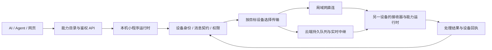

# 燕子多设备协议参考与基础能力审查

日期：2026-10-02。结论来自本仓库源码、隔离测试和以下项目的固定源码版本；涉及实现推导的判断在下文列出证据。燕子已经具备跨设备 AI 运行平台的主要模块，本轮按审查补齐设备身份、消息路由和可靠投递层。下文保留原始缺口及对应实现；新平台的后台保活与系统能力仍需要平台适配。

## 参考项目已拉取

源码位于 `C:/Users/Administrator/AppData/Local/Temp/YanziReferences-20261002/`。仅用于阅读和对照，未运行这些项目，也未复制其实现进燕子。

| 项目 | 固定提交 | 重点参考 | 已检查的源码或规范 |
| --- | --- | --- | --- |
| [KDE Connect Android](https://github.com/KDE/kdeconnect-android) | `e90a0d458cbbd875dbff2b43d1be76556f2a9d58` | 设备配对、插件能力、局域网握手 | `NetworkPacket.kt`、`backends/lan/LanLinkProvider.kt`、`Device.kt` |
| [Syncthing](https://github.com/syncthing/syncthing) | `05b6704ef5080b8013c690b83b831d0dbedca5a0` | 稳定设备身份、握手、块校验、协议不兼容处理 | `lib/protocol/bep_hello.go`、`bep_clusterconfig.go`、`lib/connections` |
| [Matrix Spec](https://github.com/matrix-org/matrix-spec) | `3291b027cb704b7f6682db36ff1235aa6e3c2bbc` | 设备消息、事务 ID、同步与回执 | `content/client-server-api/_index.md` 的 Transaction identifiers 与设备管理 |

[KDE Connect 官方项目](https://github.com/KDE/kdeconnect-android)说明其通过 Wi-Fi 和 TLS 连接设备；其 LAN 握手源码校验设备证书和协议降级。[Syncthing BEP](https://docs.syncthing.net/specs/bep-v1.html)将设备身份、Hello 和块哈希定义为协议内容。[Matrix Client-Server API](https://spec.matrix.org/latest/client-server-api/)定义设备范围内的事务 ID 和重复请求响应。这些分别适合作为安全连接、可靠数据传输和消息语义的参考。

## 当前模块关系

能力 API 决定“允许调用什么”，设备协议决定“在哪个设备执行、如何送达、如何确认”。传输方式不应改变业务目标或生成新的逻辑操作身份。

建议保留“账号内云端持久协调 + 设备之间局域网直连”的结构。能力调用关系可以是网状，消息真源仍需要明确归属；无需立即引入 Matrix 的完整跨服务器联邦或全局事件图。设备网络和小程序能力图分开建模，再以设备 ID、运行时 ID、能力名和授权范围连接。上述选择是结合燕子个人设备场景的设计判断。

## 本次已补齐

1. **明确设备目标优先。** 原 `accountChat` 分支优先于 `targetDeviceId`，指定设备的聊天也可能扩散。现在云端入队、HTTP/SSE 拉取、WebSocket 路由、ACK 校验和离线推送统一遵守显式目标，兼容历史带错误 `accountChat` 标记的定向记录。
2. **执行请求固定单个设备。** `run-*`、`fs-*`、`capability.invoke` 不再按平台向多台设备广播执行。旧客户端仅有一个候选设备时自动固定目标；零个或多个候选返回 `409 target_device_required`，包含候选设备 ID。新客户端应直接传 `targetDeviceId`。
3. **协议发现。** 带鉴权的 `GET /v1/me/devices/protocol` 在云端与桌面 LAN 提供 `yanzi.device-messaging` 版本、路由、传输和大小限制。省略 `protocolVersion` 的旧请求按版本 1 兼容，显式不支持的版本返回 426 和支持列表。
4. **新设备类型可接入。** 平台改为 1–32 位小写标识符，保留已有 desktop/android/ios/web。新设备以 `capabilities.receiveAccountChat=true` 明确参加账号聊天；没有该能力时不会被聊天广播唤起。指定设备消息不依赖平台枚举。
5. **稳定重试。** 云端新消息使用递归排序后的 JSON 哈希，字段顺序变化不再造成错误的 ID 冲突；仍兼容原精确请求哈希。真正改变内容返回 409。电脑远程操作和双向文件已有持久化去重记录。
6. **LAN 与云端使用相同设备身份。** 桌面发现响应新增稳定 `deviceId`，保留旧 `device_id` 显示名字段。手机保留最近发现的电脑 ID，远程云端回退优先定向这台电脑；调用方也可在远程操作 payload 指定 `targetDeviceId`。
7. **文件直传。** 照片、截图和普通文件均支持双向 LAN 二进制传输、SHA-256、30 MiB 限制、处理确认和云端回退。详见 `yanzi-lan-transfer-progress-2026-10-02.md`。

核心云端路由在 `cloudflare/src/device-message-protocol.js`。协议测试覆盖 5 个逻辑设备（两台电脑、一台手机、两种新设备类型），不是以单台设备测试代替多端路由验证。

## 原始审查缺口（修改前的证据）

| 优先级 | 缺口与证据 | 应补的机制 | 验收条件 |
| --- | --- | --- | --- |
| P0 | `LanDiscoveryService` 仍在发现响应中携带共享 Token，LAN HTTP 使用明文；设备 ID 本身不是认证身份 | 每设备密钥、显式配对确认、加密连接、证书或公钥固定、撤销与轮换；发现只发公开信息 | 未配对设备无法取到操作凭据；身份冒用和降级被拒绝；撤销立即生效 |
| P0 | 桌面 `LastKnownMobileIp` 仅保存最后一台手机；收到更多设备后会替换路由 | 按稳定 deviceId 建立 Peer Registry，保存多个传输地址、能力、最后验证时间 | 两手机两电脑同时在线时，定向消息及附件只到指定设备 |
| P0 | LAN 成功后直接返回，未把账号广播消息同步到其余设备；离线发送没有统一持久化发件队列 | 先持久化逻辑消息，再选择 LAN/云端；定向和账号广播显式区分；按接收设备补投与去重 | 第三设备离线后上线能补齐账号消息；重启和 ACK 丢失不丢消息、不重复业务效果 |
| P0 | 执行请求若未设置过期时间，可能在很久后由离线设备执行 | 服务端短执行期限、客户端执行前复核、取消与超时终态 | 过期命令永不执行，取消不会被重连恢复成待执行 |
| P1 | 当前云端 HTTP、WS、LAN、运行时审计各有 ID；能力调用的 trace 尚未贯通设备消息 | 明确 messageId、clientMessageId、operationId、correlationId、causationId、traceId，统一错误码 | 能用一个 trace 从 AI 调用追踪到目标设备和最终结果 |
| P1 | 聊天 ACK 为每设备记录；命令目前为单目标终态；发件人的跨端设备视图仍有限 | 设备收件箱、已保存/已执行/失败分离，结果记录与业务操作事务绑定 | 执行后崩溃不会自动再执行；UI 可以显示“结果待确认”而不是假定失败后重做 |
| P1 | 文件当前整文件重传，无分块续传；手机保留长期接收文件与 receipt | 块清单、断点恢复、取消、空间预检查、配额、保留期与回执清理 | 大文件断线只补缺失块；磁盘满明确失败；清理不破坏活动消息 |
| P1 | WebSocket 是唤醒通道，D1 是真源；暂无通用跨设备事件 cursor/顺序契约 | 单调 cursor、去重窗口、分页补齐、必要的会话顺序和背压 | 丢失实时通知、乱序和 reconnect storm 后结果仍一致 |
| P1 | Agent 的本机能力权限与账号/设备认证是两层不同机制 | 以账户、设备、应用、能力和资源形成权限范围，避免共享全权 Token | 某网页获准读便签，不能借路由层执行终端或读取其他设备文件 |
| P2 | 新平台可以注册，但仍须实现自己的客户端、推送适配器和能力接收器 | 通用设备 SDK、可选功能协商、协议黄金向量与错误用例 | 添加 Linux/iOS/浏览器/嵌入式设备不再复制 Android 特判 |

这张表保留修改前的审查证据；当前实现与验收状态以以下表格和协议文档为准。

## 按报告补齐后的状态

| 原缺口 | 实际修改 | 状态与边界 |
| --- | --- | --- |
| LAN 身份与明文凭据 | 同账号后台自动连接、独立 256 位密钥、AES-GCM 请求与响应、身份/目标/时间/重放检查、权限及撤销；UDP 不发送 Token | 已实现；外部明文操作返回 426。本轮采用应用层 AEAD，不宣称已实现 TLS 证书体系 |
| 单一最后设备地址 | 按账号及稳定设备 ID 持久化 Peer Registry，每设备多个已认证地址；聊天界面可选择指定设备 | 已实现；旧地址及已撤销配对不参与路由；多候选不猜目标 |
| LAN 成功后广播遗漏、离线丢消息 | Windows/Android 先保存 Outbox 和附件快照，LAN 即时送达后仍入账号云队列，接收端共享逻辑 ID 去重 | 已实现；上传失败后台补投，永久拒绝隔离，不阻塞后续队列 |
| 延迟执行、取消、执行重复 | 默认 120 秒/最多 300 秒、目标执行前复核、服务端原子 claim、pending 取消、持久执行记录 | 已实现；崩溃后不自动重做，结果未知单独呈现。无法把任意外部副作用承诺为严格 exactly-once |
| trace 与设备回执 | 根消息 ID、操作/关联/因果/trace 贯通；账号聊天逐设备回执、终态不可降级、界面读取实际回执 | 已实现；命令未知可由后续确定结果收敛 |
| 分块、空间、保留期 | ≥2 MiB 使用 1 MiB SHA-256 块清单、缺块查询、提交与取消；接收空间预检查、300 MiB 配额、活动/终态清理 | 已实现；30 MiB 单文件上限，7 日云附件期限；未知执行记录保守保留，不擅自清理后重做 |
| cursor 与背压 | D1 持久单调序号、分页补齐、实时通道只唤醒；发送与接收分离、并发/队列限额 | 已实现；重连从未确认队列恢复，丢实时通知不会丢消息 |
| 网页/应用最小权限 | 用户、源设备、应用、目标设备、能力名、文件根目录、有效期、撤销绑定的凭据 | 已实现；云端与目标执行器都检查资源边界，Windows 目录链接越界被拒绝 |
| 新设备接入 | 通用 JS SDK、浏览器 IndexedDB 与 Node SQLite 持久存储、CAS 收件箱、功能协商、共享 AEAD 黄金向量 | 基础 SDK 已实现；Linux 标签适配器已在本机端到端验证，实际 Linux/iOS/嵌入式系统适配和推送须另行实现 |

实现约定见 [设备协议 v1](yanzi-device-message-protocol-v1.md)，接入样例见 [SDK](../protocol/sdk/README.md)，局域网结果见 [传输验收](yanzi-lan-transfer-progress-2026-10-02.md)。数据库迁移为 `0022`（生命周期/序号）、`0023`（受限设备凭据）、`0024`（用户+源设备范围幂等键）。

## 验收与发布边界

- 真实小程序互调 35 项通过（双向互调、剪贴板、日历持久化、权限、重启/热重载），产物 `C:/Users/Administrator/AppData/Local/Temp/YanziDev/capabilities/run-95f3689f835e4c17a3a93da4bb211c6f/result.json`。
- 桌面能力/API 50 项、加密配对 14 项、分块/取消/配额/目录链接边界/自动连接 23 项、真实客户端持久 Outbox 6 项；同步覆盖与数据安全验证通过。
- Worker 与 SDK Node 测试共 22 项；共享加密向量验证中文 AAD、密文、哈希及篡改拒绝。
- 隔离 Worker 协议回归 73 项：两电脑、两手机、新设备能力加入、显式路由、跨账号/源设备幂等、TTL、取消/claim、trace、分页、凭据范围和撤销、结果未知收敛。设备为逻辑注册，不代表四台物理硬件。
- 物理硬件为一台 Windows 与一台 OnePlus GM1900 独立 Dev；覆盖双向照片/普通文件、SHA-256、文件和终端局域网优先、相同操作重试无重复效果。
- 电脑向手机发送 3 MiB+1 文件时故意丢弃首块确认：首块只发一次，重试只补缺块；完成后重复提交不重发文件、不重复聊天记录。
- 真机云端完整回归包括前台/后台、通知权限拒绝及恢复、断线重连、附件 Range、完整性失败、远程操作结果、进程重启、实际 120 秒离线过期和上线恢复。

最终完整真机回归产物：`C:/Users/Administrator/AppData/Local/Temp/YanziDev/message-bridge/1e977aed92814d1ca8db2381d1f55788/result.txt`（其内置协议检查为 73 项）。补充的 73 项协议检查在同一隔离 Worker 连续两次运行通过，连同受限 SDK 实际副作用验证，产物：`C:/Users/Administrator/AppData/Local/Temp/YanziDev/device-foundation/2da7516a8573458d9eccd5d6785dad89/result.txt`。

本轮云端修改仅在隔离本地 Worker 验证，未发布线上。线上需通过仓库规定的 Git CI/CD 及数据库迁移接入；旧客户端外部明文 LAN 被主动拒绝，需升级，登录同一账号后自动连接。生产手机包保持不变。不能将这些结果扩大为已完成任意新操作系统的适配，或已在生产云端上线。

可重复的基础协议端到端入口：`powershell -NoProfile -ExecutionPolicy Bypass -File scripts/test-device-network-foundation.ps1`。自动创建本地隔离 D1/Worker、连续运行两轮协议检查与受限网页到新设备 SDK 实际写入验证，退出时停止完整 Worker 进程树；不依赖真实账号或物理手机。

## 用户反馈后的连接简化

2026-10-02 按用户反馈取消人工复制设备 ID 和配对密钥。账号登录即为设备间连接授权，后台自动交换连接信息并发现 LAN；手机和电脑页面仅展示连接状态和刷新。继续保留加密、跨账号隔离、稳定设备目标及原有远程操作开关。桌面新安装默认开启局域网，用户已有明确关闭的设置仍保留。受限网页/应用凭据不能取得全权账号 LAN 密钥。新增 `/v1/me/devices/lan-links`，无需数据库迁移；云端仍需通过仓库 Git CI/CD 发布。

自动连接专项：同账号两端取得一致密钥、其他账号拒绝、未启用设备排除、受限网页凭据拒绝，隔离 Worker 共 73 项连续两轮通过；Node 22 项通过；桌面加密 14 项、分块/存储/自动导入边界 23 项通过。真实手机已确认自动连接信息、UDP 发现及双向加密握手，无人工导入步骤。完整回归使用 `scripts/test-real-phone-message-bridge.ps1 -SkipBuild -VerifyAccountLan`，以独立 Dev 包与隔离账号验证；测试暂时停止桌面 UDP 服务避免端口冲突，结束自动恢复桌面。

自动连接最终真机完整回归通过：`C:/Users/Administrator/AppData/Local/Temp/YanziDev/message-bridge/1e977aed92814d1ca8db2381d1f55788/result.txt`。包含手机和电脑自动建立同账号连接、认证后的 LAN 发现、双向文本/附件、远程结果、通知权限、重连、进程恢复及 120 秒离线过期；测试退出时恢复 Dev 原偏好、保持生产包不变、重新启动桌面。新版 Dev 已安装；同代码 debug APK 为 `mobile/android/app/build/manual-debug/yanzi-mobile-debug.apk`。云端自动连接接口尚未发布，线上同账号自动连接需随代码发布后生效。
