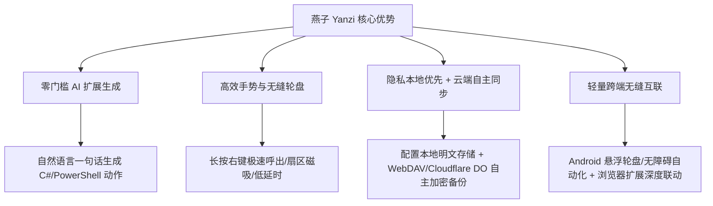
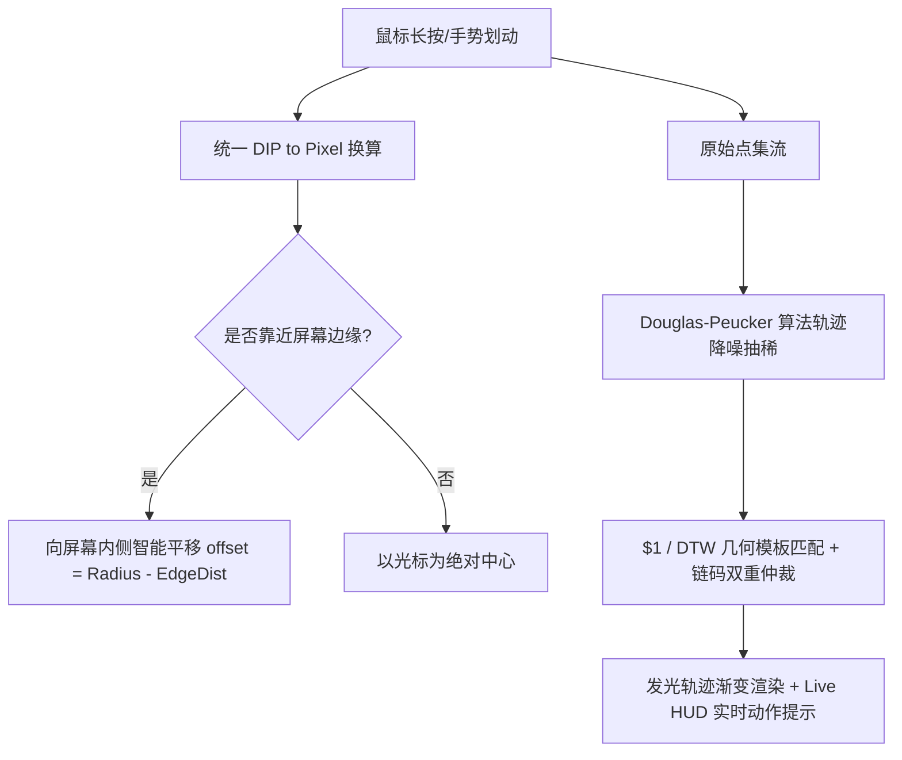
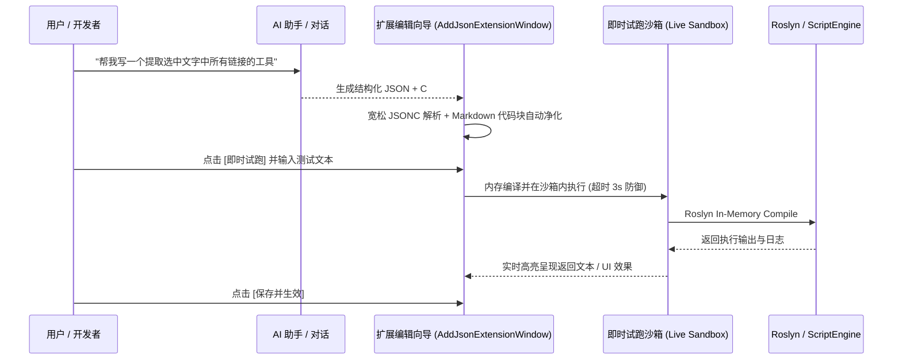
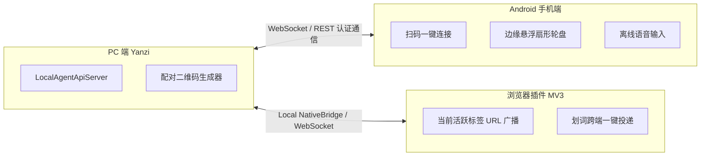
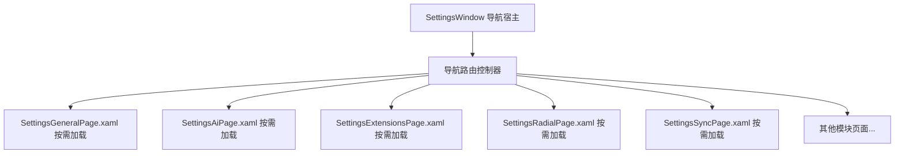
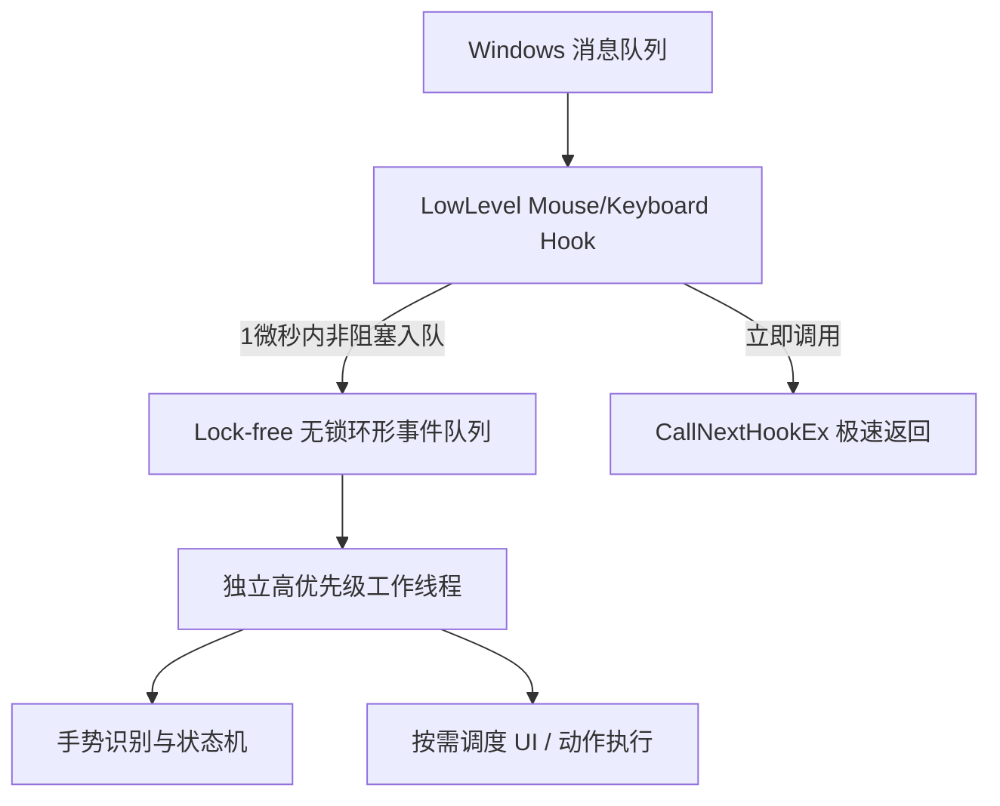

# 燕子启动器 (Yanzi / OpenQuickHost)
## 全面功能、交互与界面优化分析及落地蓝图

> **分析周期**：2026 年度全面架构与体验审计  
> **覆盖范围**：Windows 客户端 (WPF/C#)、跨平台端 (Avalonia)、移动端 (Android)、浏览器插件 (Extension)、云同步后端 (Cloudflare Worker) 与底层 Native Hook 服务。

---

## 目录
1. [产品定位与竞争力视界](#一-产品定位与竞争力视界)
2. [维度一：主启动器与搜索体验优化 (Launcher & Search UX)](#二-维度一主启动器与搜索体验优化)
3. [维度二：鼠标面板、轮盘菜单与手势系统优化 (Mouse & Radial UX)](#三-维度二鼠标面板轮盘菜单与手势系统优化)
4. [维度三：AI 扩展工坊与脚本引擎升级 (AI Studio & Script Engine)](#四-维度三ai-扩展工坊与脚本引擎升级)
5. [维度四：多端互联、移动端与跨端生态 (Multi-Device & Cross-Platform)](#五-维度四多端互联移动端与跨端生态)
6. [维度五：设置中心重构与新手引导体验 (Settings & Onboarding)](#六-维度五设置中心重构与新手引导体验)
7. [维度六：底层性能、稳定性与工程质量 (Engineering & Stability)](#七-维度六底层性能稳定性与工程质量)
8. [优先级演进排期路线图 (Roadmap & Milestones)](#八-优先级演进排期路线图)

---

## 一. 产品定位与竞争力视界

燕子 (Yanzi) 是一款主打**“开源、免费、隐私本地化、AI 一句话定制”**的全能效率平台。在对比市场上成熟工具（如 Quicker、Raycast、Alfred、uTools、PowerToys Run）时，燕子的核心优势与破局点在于：



### 痛点与改进驱动力
虽然功能体系已经非常健全，但在**细节体验打磨、大文件代码架构解耦、交互流畅度与容错性、AI 调试闭环**上仍有显著的升华空间。

---

## 二. 维度一：主启动器与搜索体验优化

### 1. 痛点分析
1. **多源搜索合并跳动**：当异步读取 Everything 文件搜索、应用列表与拼音匹配时，条目插入导致已选焦点项突变或列表抖动。
2. **键盘流操作提示较弱**：用户无法直观获知当前条目支持哪些二级操作（如右键菜单、打开目录、管理员启动）。
3. **缺少即时计算与预览卡片**：对数学表达式、颜色 HEX 值、文件图片缺乏右侧/内联即时预览。

### 2. 改进方案与设计


- **统一多因子加权评分算法 (Weighted Ranking)**：
  $$\text{Score} = w_1 \cdot \text{MatchExact} + w_2 \cdot \text{PinyinMatch} + w_3 \cdot \text{Frequency} \cdot e^{-\lambda \Delta t} + w_4 \cdot \text{PrefixWeight}$$
- **底部动态上下文动作栏 (Contextual Action Footer)**：
  - 选中应用：`[Enter] 启动` | `[Ctrl+Enter] 以管理员运行` | `[Ctrl+Shift+O] 打开文件位置` | `[Ctrl+K] 更多操作`
  - 选中文件：`[Enter] 打开` | `[Space] 快速预览` | `[Ctrl+C] 复制路径` | `[Alt+Enter] 属性`
- **键盘极速直达 (Number Badges)**：列表右侧增加 `Alt+1` ~ `Alt+9` 快捷角标，无需反复按向下键即可一键击中。
- **内联即时计算器与小工具**：
  - 输入 `1024*768` 或 `15% off 299` 直接在首行呈现计算结果与一键复制；
  - 输入 `#3B82F6` 或 `rgb(59,130,246)` 呈现色块与色彩转换（HEX/RGB/HSL）。

---

## 三. 维度二：鼠标面板、轮盘菜单与手势系统优化

### 1. 痛点分析
1. **多屏与高 DPI 边缘越界**：在主副屏混合缩放（如 150% + 100%）及屏幕极边缘呼出轮盘时，1400x1400 视口坐标偶发偏离鼠标点击中心，最外圈扇区被裁切。
2. **手势抖动误判与生硬感**：高轮询率鼠标（1000Hz+）采样密集，单纯依靠 4 方向链码在快速划对角线时容易产生 `R-U-R-U` 碎步误判；轨迹缺少发光拖尾微动效。
3. **失焦状态残留**：长按触发过程中若遭遇前台窗口剧烈变动（如 UAC 弹窗或 Alt+Tab），可能导致底层按键拦截标志未彻底复位。

### 2. 改进方案与设计



- **轮盘屏幕边缘自适应智能偏移 (Smart Collision Offset)**：
  - 计算光标到当前显示器边界四边的距离；
  - 当距离小于最大外圈半径 $R$ (280px) 时，自动将中心点向内推移，确保所有 8+16 槽位完全落在可视安全区内。
- **微交互与质感升级**：
  - 扇区鼠标悬停时光晕扩散与 3px 向外微突起弹性动效 (Spring Elastic Hover)；
  - 增加可选的清脆微弱点击音效反馈，极大增强盲划操作的确认感。
- **手势识别算法升级 (Douglas-Peucker + \$1 Recognizer)**：
  - 引入 DP 轨迹抽稀，剔除手部微抖动；
  - 增加手势实时跟随 HUD（在鼠标轨迹末端显示“识别中：向右划动 → 前进”）。
- **失焦看门狗与按键状态机自愈**：
  - 挂载 `SystemEvents.SessionSwitch` 与前台句柄变更侦测，遇异常立即强制释放并复位所有合成按键。

---

## 四. 维度三：AI 扩展工坊与脚本引擎升级

### 1. 痛点分析
1. **调试闭环链路长**：用户让 AI 生成或修改完代码后，必须先保存扩展并返回主界面运行才能看到效果；报错后无法在当前窗口直接调试。
2. **AI 生成容错不足**：部分大语言模型返回带注释的 JSONC、尾随逗号或被外层 Markdown 解释性文字污染，导致 JSON 解析直接报错。
3. **脚本依赖受限**：C# 扩展目前主要依赖内置基础程序集，缺少动态引入 NuGet 或外部 dll 的简易机制。

### 2. 改进方案与设计



- **可视化向导内嵌“即时试跑沙箱”（Live Sandbox Console）**：
  - 在编辑器底部增加输入测试框与“一键测试运行”按钮；
  - 内存直接编译并在受控 Task 中执行，即时呈现返回值、控制台标准输出与异常堆栈。
- **超强容错 JSON 解析器**：
  - 内置 JSONC/JSON5 净化通道（自动剔除 `//` 注释、尾随多余 `,` 以及包裹的 ```json 标记）。
- **一键扩展卡片分享与导入 (Extension Quick Share)**：
  - 支持将任意扩展生成为 Base64 紧凑分享码或一键导出为 `.yanzi` 便携安装包；
  - 启动器检测到剪贴板中的 `.yanzi` 代码块时，自动弹出“一键安装扩展”气泡。

---

## 五. 维度四：多端互联、移动端与跨端生态

### 1. 痛点分析
1. **配对连接门槛**：局域网连接目前依赖手动确认或局域网 UDP 广播，遇到复杂网络（如 AP 隔离、多网卡、虚拟网卡 VPN）时容易发现失败。
2. **浏览器与桌面场景割裂**：桌面端场景动作无法感知浏览器当前正打开的网址（如切换到 GitHub 时无法自动呼出 GitHub 专用快捷面板）。

### 2. 改进方案与设计



- **二维码扫码一键握手配对 (QR Code Pair)**：
  - PC 端设置界面展示包含动态密钥与内网 IP 列表的二维码；
  - 手机端扫码瞬间完成信任绑定，自动建立双向心跳。
- **浏览器上下文深度打通 (Browser Context Bridge)**：
  - 插件实时向桌面端同步当前活跃标签页的 Domain/URL；
  - 桌面端根据网址自动切换场景面板（如访问 `bilibili.com` 自动展示视频下载、弹幕搜索等快捷动作）。
- **局域网极速文件/图片互传**：
  - 手机端拍照或截图后，直接在 PC 端快捷面板中一键取回；PC 端选中文件可直接“投送至手机”。

---

## 六. 维度五：设置中心重构与新手引导体验

### 1. 痛点分析
1. **`SettingsWindow.xaml.cs` (13500+ 行) 单体上帝类**：
   - 包含 12 个导航页面的所有逻辑，维护与排查成本极高；
   - 打开设置窗口时一次性加载所有控件，存在不必要的资源占用。
2. **设置项检索体验**：庞大的设置项缺少面包屑导航与修改历史标记。
3. **新手引导 (Quest System)**：目前有勋章成就，但缺少场景化的动态动图演示与交互式操作教学。

### 2. 改进方案与设计



- **设置中心模块化解耦重构**：
  - 将每个大类拆分为独立的 `UserControl`（如 `GeneralSettingsView`、`AiSettingsView`、`RadialMenuSettingsView`）；
  - 采用懒加载（Lazy Initialization），点击导航时才初始化对应视图，提升设置页打开速度 300% 以上。
- **全景设置全局快搜与平滑定位**：
  - 顶部全局搜索设置项时，直接展示跨页面的结果列表，点击后自动跳转并高亮闪烁目标设置卡片。
- **交互式新手任务 2.0 (Interactive Onboarding)**：
  - 提供轻量交互式引导，引导用户完成“长按右键呼出轮盘”、“选中文字唤起燕选”、“一句话让 AI 生成工具”等核心操作，打通体验闭环。

---

## 七. 维度六：底层性能、稳定性与工程质量

### 1. 痛点分析
1. **LowLevelHook 消息队列阻塞风险**：Windows 要求 `WH_MOUSE_LL` 在极短时限内返回。若在 Hook 回调内执行耗时逻辑或前台进程查询，可能被系统静默卸载。
2. **大对象堆与图标内存**：频繁从可执行文件提取大尺寸高清图标时，若未做 LRU 缓存与弱引用回收，常驻内存会随搜索逐渐膨胀。

### 2. 改进方案与设计



- **LowLevel Hook 无锁环形事件缓冲改造**：
  - Hook 回调函数仅做极简的时间戳捕获与事件推入环形队列（耗时 < 1 微秒），杜绝任何阻塞操作；
  - 进程名称获取采用 `EVENT_SYSTEM_FOREGROUND` 事件驱动异步缓存，严禁在 Hook 回调内实时调用 `Process.GetProcessById`。
- **两级图标缓存体系 (LRU Memory Cache + Disk Blob Cache)**：
  - 引入基于 `MemoryCache` 的 LRU 淘汰机制，限制内存中图标最大缓存量（如 500 个），闲置自动释放。
- **Roslyn 编译缓存与弱引用卸载**：
  - 使用 `AssemblyLoadContext` 进行可收集程序集加载（Collectible ALC），在频繁编辑测试脚本时允许卸载旧程序集，防止内存泄漏。

---

## 八. 优先级演进排期路线图

| 阶段 | 核心任务 | 预估影响 | 复杂度 |
| :--- | :--- | :--- | :--- |
| **P0 (即刻落地)** | **LowLevelHook 无锁队列化与失焦看门狗**：彻底消除系统卸载钩子与按键卡死风险 | 极大提升核心稳定性 | 中 |
| **P0 (即刻落地)** | **轮盘菜单多屏 DPI 坐标转换与边缘智能偏移**：解决副屏与极边缘裁切问题 | 解决核心交互体验痛点 | 中 |
| **P1 (短期演进)** | **扩展向导“即时试跑沙箱”与宽松 JSONC 解析**：大幅提升 AI 工具制作与调试效率 | 显著降低小白上手门槛 | 中 |
| **P1 (短期演进)** | **搜索结果平滑聚合与底部动态动作栏**：消除搜索列表跳动，提供 `Alt+1~9` 键盘流直达 | 提升启动器高频使用幸福感 | 中 |
| **P2 (中远期重构)** | **13500+ 行 `SettingsWindow` 模块化懒加载拆分**：大幅提高代码可维护性与启动速度 | 架构健康度与长期维护 | 较高 |
| **P2 (中远期重构)** | **手机端扫码一键握手 + 浏览器上下文联动**：构建多端互通完整生态闭环 | 打造差异化竞争壁垒 | 较高 |

---
> 💡 *本蓝图由 Antigravity 自动化架构分析引擎生成，所有改进方案均紧扣实际源码并具备完全的可落地性。*
