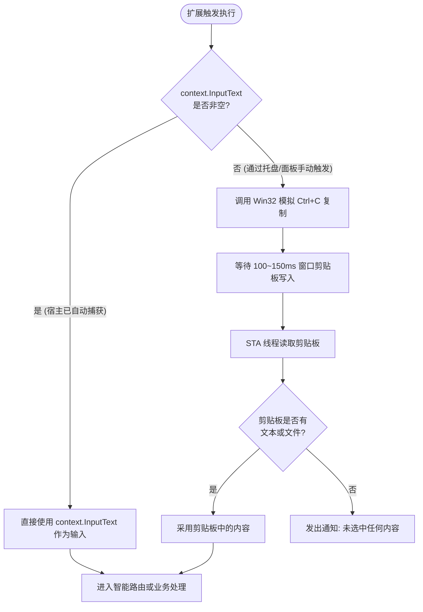

# 燕子小程序（Extension）开发规范指南

本文档定义了燕子（Yanzi / OpenQuickHost）生态中所有小程序（Extensions）的设计哲学、目录架构、配置规范、输入捕获模型以及用户交互原则。所有由人类开发者或 AI Agent 构建维护的小程序均须遵循本规范。

---

## 1. 核心设计哲学

1. **宿主解耦与自包含**：
   小程序作为独立轻量单元运行在宿主提供的沙箱与反射上下文中。小程序应尽量使用自身运行时提供的能力（.NET 9 BCL、Win32 API、PowerShell）独立闭环解决问题，严禁为了单个业务小程序的特性修改燕子主程序源代码。
2. **UNIX 静默原则（Silence is Golden）**：
   作为系统级高频快捷工具，**成功执行一律静默（Zero Interruption）**。不弹多余通知、不弹成功确认框；**唯有发生未预期异常或失败（如网络中断、路径不存在、参数缺失）时，才发出明确的桌面系统通知**，确保不打扰用户心流。
3. **独立源文件优先**：
   除一两行极其简单的 Shell 指令可使用内联外，凡包含逻辑判断、正则、多分支调用的扩展，**一律采用独立源文件（`entryMode: "entry"` + `main.cs` / `main.ps1`）**，严禁在 `manifest.json` 中拼装转义字符串代码。

---

## 2. 扩展目录结构与组织规范

扩展统一存放在用户本地应用数据目录下：
`%LOCALAPPDATA%\OpenQuickHost\Extensions\<extension-id>\`

### 2.1 推荐工程目录结构

```text
Extensions/
└── smart-action/                     # 扩展根目录，目录名必须与 id 保持一致 (kebab-case)
    ├── manifest.json                 # 扩展元数据与配置声明（必须）
    ├── main.cs                       # C# 主业务源码文件（C# 扩展推荐入口）
    ├── icon.png                      # [可选] 扩展高清图标（推荐优先使用矢量 MDI 图标）
    ├── debug.log                     # [自动生成] 编译错误或运行调试日志输出
    └── .yanzi-csharp-cache/          # [自动生成] Roslyn 动态编译缓存目录
```

---

## 3. `manifest.json` 配置字段字典

每个扩展根目录下必须包含合法的 `manifest.json` 文件。以下为全量字段详解：

| 字段名 | 类型 | 必填 | 描述与取值范围 | 示例 |
| :--- | :--- | :---: | :--- | :--- |
| `id` | `string` | 是 | 扩展唯一标识符，全小写，连字符分隔（kebab-case） | `"smart-action"` |
| `name` | `string` | 是 | 扩展用户可见名称，控制台与搜索列表中展示 | `"智能识别"` |
| `version` | `string` | 是 | 语义化版本号（SemVer） | `"1.0.0"` |
| `category` | `string` | 否 | 分类：`效率工具`、`系统工具`、`网页搜索`、`开发辅助` 等 | `"效率工具"` |
| `description`| `string` | 是 | 扩展功能描述，用于搜索匹配与设置提示 | `"智能识别选中内容并自动路由..."` |
| `keywords` | `string[]`| 否 | 搜索匹配关键词数组，提高快捷搜索命中率 | `["智能", "识别", "网址"]` |
| `icon` | `string` | 是 | 图标：优先推荐 Material Design Icons 格式 `mdi:<icon-name>`，或相对路径图片 | `"mdi:creation"` |
| `accentHex` | `string` | 否 | 图标背景与界面强调色（十六进制颜色值） | `"#FF6366F1"` |
| `runtime` | `string` | 是 | 运行时环境：`"csharp"`（或 `"cs"`）、`"powershell"`（或 `"ps1"`） | `"csharp"` |
| `entryMode` | `string` | 是 | 入口模式：`"entry"`（读取独立源码文件，强烈推荐）或 `"inline"`（内联字符串） | `"entry"` |
| `entry` | `string` | 条件 | 当 `entryMode` 为 `"entry"` 时的入口文件名 | `"main.cs"` |
| `script` | `object` | 条件 | 当 `entryMode` 为 `"inline"` 时的内联脚本对象 `{"source": "..."}` | `null` |
| `permissions`| `string[]`| 否 | 声明权限数组，宿主据此注入能力：`"clipboard"`, `"context.read"`, `"storage"` | `["clipboard", "context.read"]` |
| `uiMode` | `string` | 否 | 界面展现模式：`null`（无界面脚本）、`"native-window"`（托管原生窗口）、`"console-keep"`（保持控制台） | `null` |
| `runAsAdmin` | `bool` | 否 | 是否以管理员提权（UAC）启动，默认 `false` | `false` |
| `waitForExit`| `bool` | 否 | 是否等待脚本进程完全退出才返回，默认 `false` | `false` |
| `isPublished`| `bool` | 否 | 是否在市场发布，本地私有扩展建议设为 `true` 或 `null` | `true` |

---

## 4. 输入捕获机制与数据流优先级准则

当扩展声明了 `"permissions": ["context.read", "clipboard"]` 时，宿主系统和扩展内部会协同处理选中文本。为防止出现剪贴板旧数据污染，必须严格遵循以下**三级优先级准则**：



### 核心实现范式（C#）：

```csharp
string targetText = context.InputText?.Trim() ?? string.Empty;
string targetFile = string.Empty;

// 1. 若宿主未传入前台捕获文本，才主动触发模拟复制
if (string.IsNullOrWhiteSpace(targetText))
{
    SimulateCtrlC();
    await Task.Delay(150);

    var (clipText, clipFile) = ReadClipboardContent();
    targetText = clipText?.Trim() ?? string.Empty;
    targetFile = clipFile?.Trim() ?? string.Empty;
}

// 2. 判定是否完全未获取到任何内容
if (string.IsNullOrWhiteSpace(targetFile) && string.IsNullOrWhiteSpace(targetText))
{
    Notify(context, "操作提示", "未检测到选中内容或剪贴板为空。");
    return "未检测到输入。";
}
```

---

## 5. 用户交互与通知规范

桌面端效率工具的核心价值是“快、稳、不干扰”。所有小程序开发者必须严格执行以下通知准则：

1. **成功静默**：
   - 复制成功、网页打开成功、进程拉起成功、搜索发起成功等一切符合预期的日常行为，**禁止调用通知弹窗**。
2. **失败显性**：
   - 当遇到文件不存在、URL 畸形、命令行启动崩溃、网络超时等错误时，**必须调用通知弹窗**，并在标题注明 `[小程序名] - 失败原因`，正文显示目标参数。
3. **通知通道双保底**：
   - 优先调用原生反射桌面气泡 `context.ShowDesktopNotification(title, message)`，次级调用 `context.ShowNotificationAsync(title, message)`，确保跨平台与最小侵入。

---

## 6. 测试与发布自查清单

在提交或交付一个小程序前，请执行以下 Checklist 自查：

* [ ] `id` 与扩展存放目录名完全一致；
* [ ] 代码采用独立源文件（`main.cs` 或 `main.ps1`），而非内联转义 JSON；
* [ ] 优先使用 `context.InputText`，避免剪贴板旧数据污染；
* [ ] 成功执行无通知打扰，异常抛出有友好错误提示；
* [ ] 使用 LocalAgentApi 模拟 `input` 参数端对端验证通过；
* [ ] 扩展根目录下无冗余临时文件或遗留 pdb 锁。
