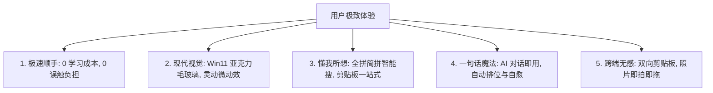
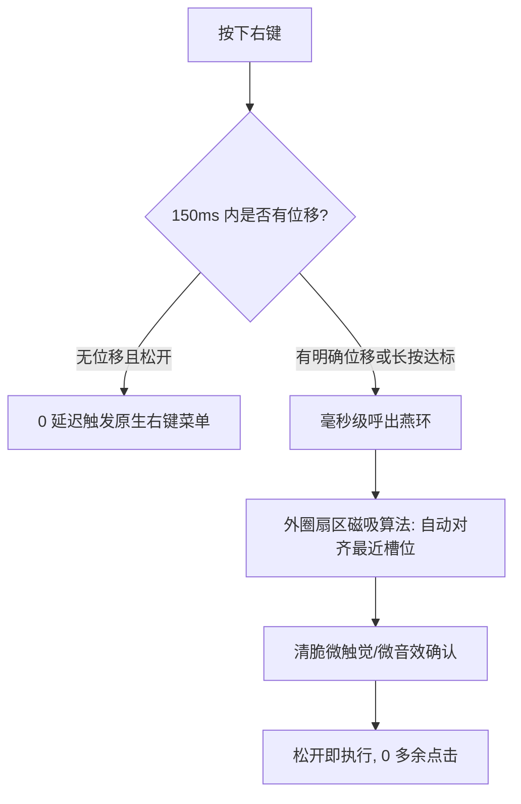

# 燕子启动器 (Yanzi)
## 以用户体验为核心的交互、功能与视觉全面进化方案

> **设计宗旨**：让工具退到无形，让效率顺手拈来。消除摩擦力，创造让用户惊艳的“哇塞时刻 (Aha Moment)”。

---

## 目录
1. [用户体验核心理念与设计哲学](#一-用户体验核心理念与设计哲学)
2. [场景一：视觉感官与第一印象体验 (Visual Aesthetics & Modern Feel)](#二-场景一视觉感官与第一印象体验)
3. [场景二：长按右键与轮盘盲操体验 (Radial Muscle Memory & Zero-Friction)](#三-场景二长按右键与轮盘盲操体验)
4. [场景三：鼠标快捷面板的“零门槛整理” (Drag & Drop Everything)](#四-场景三鼠标快捷面板的零门槛整理)
5. [场景四：启动器搜索的“懂我所想”与键盘心流 (Search & Keyboard Flow)](#五-场景四启动器搜索的懂我所想与键盘心流)
6. [场景五：AI 制作工具的“一句话魔法” (Aha Moment: One-Sentence Magic)](#六-场景五ai-制作工具的一句话魔法)
7. [场景六：多端跨屏的“无感幸福感” (Seamless Multi-Device Joy)](#七-场景六多端跨屏的无感幸福感)
8. [核心改进落地优先级矩阵 (UX Priority Matrix)](#八-核心改进落地优先级矩阵)

---

## 一. 用户体验核心理念与设计哲学

普通用户在使用一款效率工具时，不会关心代码架构有多少层，他们只在乎三件事：
1. **好看吗？** —— 界面是否现代化、通透精致，符合 Windows 11 视觉审美；
2. **顺手吗？** —— 呼出是否快如闪电？盲操会不会按错？会不会干扰原本的正常操作（如误吃右键）；
3. **省心吗？** —— 能不能一秒搜出想要的东西？想做新工具时能不能真正做到“一句话搞定”，而不逼我看复杂的代码和配置文件？

---

## 二. 场景一：视觉感官与第一印象体验

### 1. 当前体验痛点
- **硬核程序员风**：当前背景多为深黑纯色（`#FF161616`）或粗糙半透明，视觉较为厚重冷硬，缺少现代 Windows 11 的通透轻盈感。
- **动效生硬**：窗口弹出、轮盘扇区划入、卡片切换时缺少自然的**弹簧物理阻尼（Spring Dynamics）**与呼吸感。

### 2. 视觉升级方案
- **Windows 11 Mica / Acrylic（亚克力高级毛玻璃）**：
  引入 Win11 原生 DWM 亚克力毛玻璃模糊材质，搭配 1px 细微半透明高光边框（Rim Light）与深邃多层次柔和弥散阴影，使启动器和悬浮面板与用户的壁纸和桌面环境完美融合。
- **灵动微交互动效 (Micro-Interactions)**：
  - 启动器弹出：`0.15s` 带有微弱缩放（0.97 -> 1.0）与透明度渐显，如同从虚空中浮现；
  - 扇区划入：鼠标划过槽位时，图标轻微浮起 2px 并伴随柔光粒子扩散；
  - 动态主题跟随系统：Windows 暗黑/明亮模式自动无缝平滑切换。

---

## 三. 场景二：长按右键与轮盘盲操体验 (核心拳头功能)

### 1. 当前体验痛点（最致命的体验杀手！）
- **右键冲突恐惧**：用户在浏览器、桌面或聊天软件里想点普通的右键菜单时，最怕工具误判弹出轮盘，或者把正常右键给“吞掉”延迟弹出。
- **外圈 16 槽位盲划易偏**：中外圈槽位太密集，用户闭着眼睛划时容易偏离目标槽位。

### 2. 改进落地方案

- **自适应右键意图判定 (Adaptive Right-Click Intent)**：
  - **短按无位移**：100% 原生右键体验，完全不干扰正常操作；
  - **带位移划动**：即使长按时间还没到 200ms，只要识别出用户鼠标有明确划动意图，瞬间激活动态轮盘（**划动手感提速 50%**）；
  - **全屏游戏/专业软件自动免打扰**：全屏独占游戏或在 PS/CAD 中画画时，自动静默禁用长按，杜绝游戏和专业操作冲突。
- **外圈扇区智能磁吸 (Magnetic Sector Snapping)**：
  对 16 槽位增加角度磁吸吸附容差，并在设置中心提供**“物理手感可视化调校盘”**，用户划动鼠标时能实时看到自己的手腕划线落在哪个扇区，调出最贴合自己肌肉记忆的灵敏度。
- **清脆音效与触觉反馈**：划中扇区与执行时提供可选的极短促微弱清脆声音反馈（类似 iOS 触感震动），让盲操信心倍增。

---

## 四. 场景三：鼠标快捷面板的“零门槛整理”

### 1. 当前体验痛点
- 往面板里添加新动作步骤多，需要选择类型、填路径或写配置，新手望而却步。

### 2. 改进落地方案
- **“万物皆可拖拽” (Drag & Drop Everything)**：
  - **拖桌面软件/文件**：直接把桌面图标、文档、文件夹拖进面板任意空槽位，自动提取高清大图标和应用名称，0 秒生成动作；
  - **拖浏览器网址**：从 Chrome/Edge 地址栏将网页链接直接拖入面板，自动抓取该网站的 Favicon 图标并命名为“打开网页”；
  - **拖选中文本**：选中文本直接拖入面板，自动生成“一键粘贴此文本”快捷卡片。
- **“高频自动置顶”智能推荐 (Smart Auto-Triage)**：
  新安装用户不用费心手动布局，面板第一页自动聚合用户今天用得最多的 6 个操作（如截图、微信、最近打开的项目），越用越懂你。

---

## 五. 场景四：启动器搜索的“懂我所想”与键盘心流

### 1. 当前体验痛点
- 输入搜索词必须非常精准，搜 `wyy` 搜不到网易云，搜 `wx` 搜不到微信，打错一个字母就什么都搜不出。
- 搜出文件后，不知道怎么打开所在目录或用管理员打开。

### 2. 改进落地方案
- **毫秒级全拼、简拼与错别字智能联想**：
  - 搜 `wyy` / `wangyiyun` $\to$ 秒出 **网易云音乐**；
  - 搜 `kzmb` / `kongzhi` $\to$ 秒出 **控制面板**；
  - 搜 `ps` / `pot` $\to$ 秒出 **Photoshop** / **PotPlayer**；
  - 并且在结果列表上对匹配到的拼音汉字精确做**彩虹高亮**。
- **底部自适应上下文动作栏 (Contextual Action Bar)**：
  手永远不需要离开键盘：
  - 聚焦应用时底部提示：`[Enter] 启动` | `[Ctrl+Enter] 管理员运行` | `[Ctrl+Shift+O] 打开文件位置`
  - 聚焦文件时底部提示：`[Enter] 打开` | `[Space] 空格极速预览` | `[Ctrl+C] 复制路径`
- **一站式剪贴板历史与图片 OCR**：
  - 呼出启动器后，搜索框为空时按一下 `Space` 或 `Tab`，瞬间切换为**剪贴板历史卡片**，再也不用担心刚复制的文字丢失；
  - 剪贴板里有图片时，首行自动展示“按 Enter 提取图片中的文字 (OCR)”，截完图直接提取文字。

---

## 六. 场景五：AI 制作工具的“一句话魔法”

### 1. 当前体验痛点
- 用户必须面对复杂的代码、JSON、配置项，一旦脚本报错看到一堆英文异常堆栈，挫败感极强。

### 2. 改进落地方案
- **无代码化对话式“工具烘焙坊” (No-Code AI Studio)**：
  - 用户只需在输入框对燕子说：`“做一个一键把剪贴板里的英文全部变成大写的工具”`；
  - 界面呈现灵动动画：*“燕子正在为你烘焙工具... 3、2、1，完成！”*；
  - 弹窗提示：*“工具【英文大写转换】已自动为您放入鼠标面板第 1 格，点击即可试用！”*。
  - **用户全过程看不见一行代码，3 秒体验到“一句话定制工具”的神奇成就感 (Aha Moment)**。
- **异常智能温情自愈 (Graceful Self-Healing)**：
  - 当某个自动化动作因为外部软件更新或参数变动失败时，不弹冷冰冰的报错堆栈，而是弹出一张温馨卡片：
    *“这个工具好像遇到了点小问题，需要燕子帮你自动修复吗？”*，点击后 AI 在后台自动调整代码并更新，让工具历久弥新。

---

## 七. 场景六：多端跨屏的“无感幸福感”

### 1. 当前体验痛点
- 手机和电脑互联配对需要记 IP 地址和端口，流程繁琐。
- 手机端拍了照片或复制了文字，要在电脑上用仍然需要借道微信文件传输助手。

### 2. 改进落地方案
- **扫码即连 (One-Scan Pairing)**：
  - PC 端设置页展示一个精致的配对二维码，手机燕子 App 打开扫一扫，瞬间建立信任局域网加密通道。
- **无感双向剪贴板**：
  - 手机复制一段文字/快递单号，电脑直接 `Ctrl+V` 粘贴；电脑复制一段话，手机长按直接粘贴。
- **手机刚拍照片“隔空投送” (Instant Photo Drop)**：
  - 手机拍照后，电脑屏幕右下角轻轻浮现一个小缩略图：*“刚刚在手机拍摄的照片”*，鼠标拖拽即可直接扔进 Word、PPT 或微信聊天框，彻底告别微信文件传输助手！

---

## 八. 核心改进落地优先级矩阵

| 优先级 | 体验场景 | 核心改进措施 | 用户直接感知 |
| :--- | :--- | :--- | :--- |
| **P0 (立刻质变)** | **鼠标轮盘与右键** | **智能右键意图自适应 + 16 槽位磁吸引导** | 彻底告别右键被误吃的恐惧，盲划手感大幅提升 |
| **P0 (立刻质变)** | **启动器搜索** | **全拼/简拼混搜 (`wyy`/`wx`) + 底部快捷键动作条** | 找软件找文件快如闪电，键盘心流不被打断 |
| **P1 (惊喜体验)** | **AI 工具工坊** | **无代码化一句话生成 + 自动入槽 + 智能自愈** | 创造让小白用户惊艳的“哇塞时刻” |
| **P1 (惊喜体验)** | **快捷面板** | **万物皆可拖拽 (文件/网址/文本一拖入格)** | 整理面板 0 学习成本，顺手自然 |
| **P1 (惊喜体验)** | **剪贴板与 OCR** | **空搜一键查剪贴板历史 + 截图一键提取文字** | 高频工作流一站式满足，无需额外装软件 |
| **P2 (生态闭环)** | **多端互联** | **扫码配对 + 手机照片即拍即拖 + 双向剪贴板** | 彻底替代微信传输助手，跨端办公极致丝滑 |
| **P2 (生态闭环)** | **界面质感** | **Win11 亚克力毛玻璃材质 + 弹簧微交互动效** | 视觉从“硬核工具”升级为“高端现代化效率神器” |

---
> 💡 *让每一次呼出都顺手，让每一次划动都有确认感，让每一个需求都能被一句话满足。*
